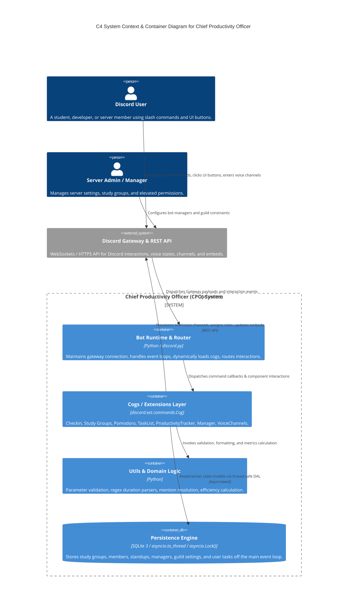
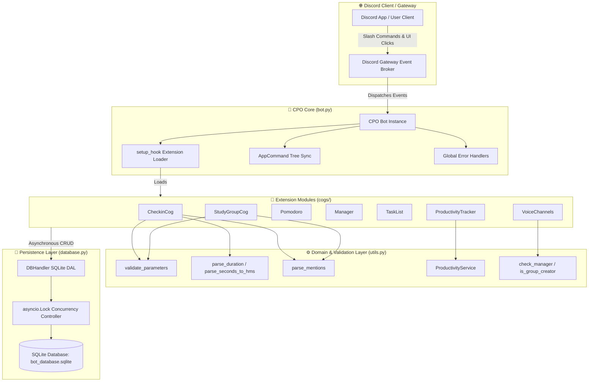
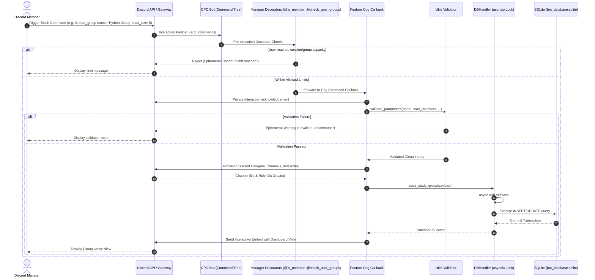
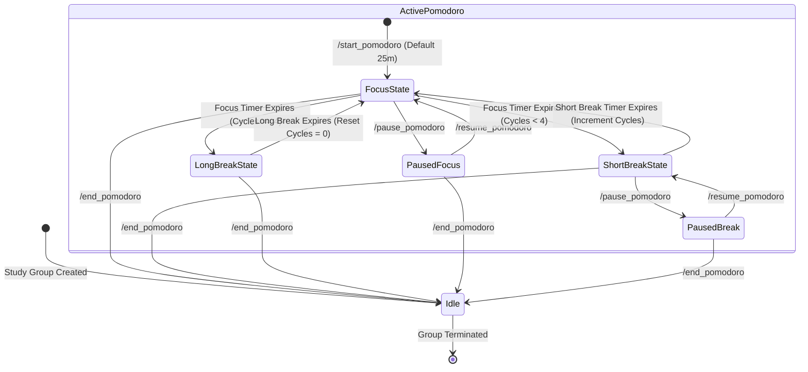
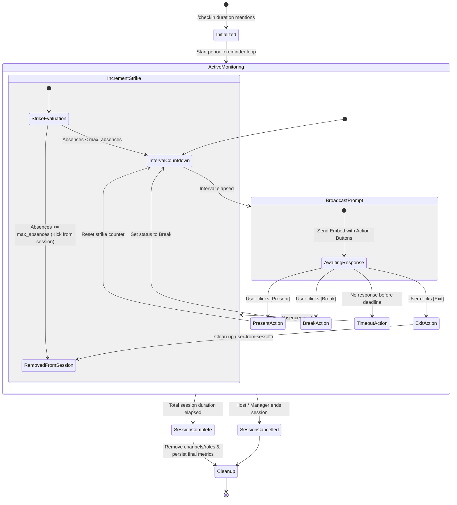
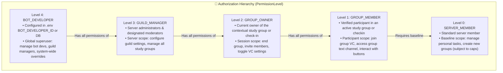
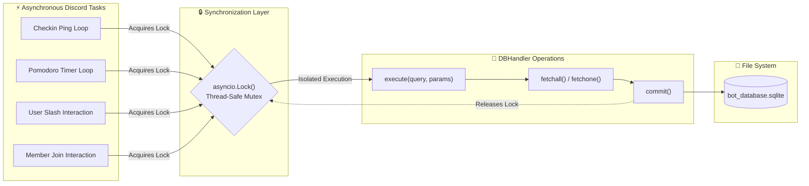

# Chief Productivity Officer (CPO) — Architecture & Technical Design

## 1. System Context & C4 Architecture Visualization

The **Chief Productivity Officer (CPO)** is an asynchronous, event-driven Discord application built on `discord.py` 2.4.x and Python 3.10+. It orchestrates productivity tools, collaborative study environments, Pomodoro focus cycles, standup check-ins, and personal task management across Discord guilds.

### rc3 lifecycle and persistence changes

Study group startup migrates legacy records with additive columns and identifier backfills. Historical table names are renamed only when current tables are absent. Legacy roster IDs remain connected to the same numeric group rows, and repeated startup preserves the migration. Saving an existing group retains its primary key. Earlier records without an activity flag stay inactive, with neutral defaults for fields absent from their original schema.

Each group owns a membership lock shared by direct joins, invitation admission, voice-setting changes, and the transition into teardown. Invitations arrive by DM with recipient-only Join/Decline controls and five-minute expiry. Admission grants the role and persists the roster before changing memory; failed persistence attempts to remove the newly granted role. Teardown blocks further admission, marks the persisted group inactive, removes current roster entries and related session aliases, and stops the dashboard controls. When Discord API deletions (text channels, voice channels, or roles) fail due to missing bot permissions or transient API errors, the uncleaned resources are recorded in the `pending_resource_cleanups` table. A background task (`cleanup_retry_loop` every 10 minutes) and startup sweep in `bot.py:on_ready` automatically re-attempt deletion when permissions are granted or prune records when the resources are confirmed gone on Discord. Server managers can also trigger `/retry_cleanups` for immediate execution and status inspection.

The initial group dashboard combines mentions, the status embed, and controls. Speak and Video preserve unrelated voice permission overwrites. A failed settings write triggers a Discord rollback; a failed rollback is logged for manual recovery. Force Video warns members after 30 seconds and allows a 60-second grace period before relocating members without camera or screen sharing to the configured default voice channel (`CPO Lobby`, `guild_settings.default_vc_id`) via `cogs/_voice_relocation.py`. If relocation is unavailable or fails, an error is logged and a private notification is sent via DM without disconnecting the member.

Task Select menus carry primary row IDs and pass the owner and exact group to `DBHandler.apply_task_action`. This prevents a legacy task number from affecting multiple rows. Task command acknowledgements follow the group/commands-channel visibility policy. Purges batch database deletion, then inspect only the current channel's latest 100 messages for bot task messages attributed to the requesting user. A Discord cleanup failure is reported privately without undoing successful database deletion.

`guild_settings.mod_log_channel_id` stores the optional destination for group lifecycle embeds. Event logs include the actor and group, suppress mentions, and tolerate missing channels or logging failures. If cleanup deletes the invocation channel and Discord returns error 10003, the final command result is sent by DM. If that DM also fails, the result is logged.

Offline verification covers these flows in pytest and executes the standalone 54-command matrix against an in-memory database. API calls are mocked; live Discord provisioning remains outside these checks.

### Server setup and reply visibility

`/setup` opens an ephemeral wizard on every invocation. Its existing `max_members` and `category` options seed a draft. The invoker can select an existing guild category or enter a new category name, then review the draft before Save. Controls belong to the invoker. Cancel and expiry discard the draft.

Save resolves the chosen category and creates `cpo-commands` and `cpo-logs` text channels or reuses their recorded channels, alongside creating or reusing the `CPO Lobby` default voice channel. Created channels inherit the selected category permissions. Recorded channels synchronize their permissions with the category when moved or when their existing permissions differ, including the logs and lobby channels. The logs channel receives existing group creation, ending, and purge events; runtime logs continue through the Python logger.

The database stores the category ID, commands channel ID, moderator log channel ID, default voice channel ID (`default_vc_id`), default member limit, and default group/Pomodoro lifetimes together. The lifetime editor accepts positive durations; both settings initially store 86400 seconds and affect new sessions. The approved migration adds these columns without replacing existing settings. The stale-draft snapshot includes both lifetimes and default VC destination. The logs channel uses the existing `guild_settings.mod_log_channel_id` field. Startup adds the nullable `guild_settings.commands_channel_id` and `guild_settings.default_vc_id` columns to existing databases; null values preserve existing defaults until setup is saved.

Discord provisioning and the SQLite write are separate operations. If a Save attempt creates resources and later fails, the wizard retains their IDs for a retry and prevents switching the draft to another category. Existing recorded channels can also remain moved after a failed settings write. Cancel and expiry disclose created or moved resource IDs for review. Created resources are not automatically deleted, and moved channels are not automatically restored.

Normal slash success replies are public in active study-group channels and the exact saved commands channel. Threads, other channels, and DMs use ephemeral replies. An unset commands channel still permits public replies in active groups. Errors, sensitive results, and the setup wizard are always private. The category controls study group placement; it does not grant public reply visibility. Dashboards, reminders, Pomodoro announcements, moderator logs, and invitation DMs keep their operational destinations.

Commands acknowledge the interaction privately before processing. A separate follow-up carries the final success or error with its own visibility, then removes the temporary acknowledgement. This avoids Discord's first deferred follow-up inheriting an earlier public response flag.

### Consent, ending, and lifetime controls

Group creation allocates a name under a per-guild lock and holds that lock through provisioning. Historical names and live sessions prevent reuse: unnamed groups use a username and session number, while custom-name collisions append a numeric suffix. Each group retains its UUID independently of the display name.

Creators join automatically. Mentioned users receive recipient-only DM Join/Decline controls before admission. Pomodoros maintain a separate opted-in participant roster for attendance, pings, and voice moves. The voice-state listener no longer starts sessions. Group dashboards retain session status fields, with check-in and Pomodoro action buttons confined to their session controls.

Staff grants carry `explicit` or `server_sync` provenance. Native staff synchronize at Level 3; sync removes stale native grants and preserves explicit grants. Older grants are migrated as explicit because their source cannot be inferred. `/user_level` uses only the active group in the invocation channel for owner/member levels and selects the highest applicable level.

`cogs/_staff_roles.py` creates or reuses CPO Manager and CPO Bot Developer roles with no guild-wide permissions, synchronizes their membership, and merges their access into the configured category and its children. New channels inherit that category's permissions. Existing children retain unrelated overwrites, including intentional Speak/Video settings. Manage Roles and role hierarchy failures leave database grants intact and return an actionable warning.

Global bot developer superuser authority (Tier 4) is anchored to `BOT_DEVELOPER_ID`. To prevent accidental privilege escalation or import-time crashes from template configurations, `utils.validate_bot_developer_id` strictly validates Discord snowflakes (17–20 digits, positive 64-bit integer) and rejects known dummy IDs (`123456789012345678`), documentation strings (`your_discord_user_id_here`), generic placeholders (`placeholder`, `changeme`, `none`), repetitive digits, floats, and booleans. Invalid startup values log a structured warning and fall back safely to `None`.

Current group/session owners and guild staff end directly. Other current participants request the current owner's approval by DM. Shared controls serialize End/Keep running decisions and expire after five minutes; confirmation rechecks activity and captured ownership. Persisted group fallback rechecks the latest database record before cleanup. Outsiders cannot request ending, and failed owner DMs leave sessions running.

Pomodoros use UTC deadlines. The timer checks expiry before pause state, offers renewal with one hour left, and offers a new prompt for each renewed deadline. Renew adds 24 hours to the existing deadline. Each stage and check-in reminder interval is 2–240 minutes. Auto-calculated Pomodoro breaks use the 5:1:3 ratio with a two-minute minimum.

Pomodoro runtime state is persisted in SQLite (`pomodoro_runtime`) via periodic JSON snapshots (bounded by a ≤15-second crash-loss window) serialized through `_runtime_lock`. Upon bot reboot, `load_active_sessions_from_db()` hydrates active sessions, advances stages offline if deadlines elapsed during bot downtime (without granting unearned focus credit), restores paused/running states, and resumes background tick loops. Ending or group teardown retires runtime records, preventing zombie session resurrection. Attended focus time is tracked in `productivity_focus_time` with monotonic cumulative seconds for opted-in participants present in voice during active focus stages, powering real unrounded efficiency metrics.

### 1.1 C4 Container Diagram



---

## 2. Component Topology & Structural Visualizations



---

## 3. Runtime Event & Interaction Pipelines

### 3.1 Slash Command Execution & Middleware Pipeline



---

## 4. State Transition Visualizations

### 4.1 Pomodoro Study Cycle State Machine



### 4.2 Checkin Standup Session State Machine



---

## 5. Security & Authorization Architecture

The authorization model implements a 5-tier Role-Based Access Control (RBAC) hierarchy defined in `cogs/manager.py`:



---

## 6. Concurrency & Persistence Isolation Model

Because SQLite is an embedded file-based database, concurrent writes from asynchronous Discord tasks must be coordinated to prevent database lock contention.



---

## 7. Logging & Observability Architecture

```mermaid
graph TD
    subgraph CodeModules ["📦 Codebase Modules"]
        M1[bot.py]
        M2[cogs/*.py]
        M3[database.py]
        M4[utils.py]
    end

    subgraph LoggerPipeline ["📝 Logging Pipeline (docs/LOGGING_STANDARDS.md)"]
        LInit["Module Loggers (logging.getLogger(__name__))"]
        Format["Structured Formatter: %(asctime)s - %(name)s - %(levelname)s - %(message)s"]
        Levels{"Log Level Filter"}
    end

    subgraph Sinks ["📊 Outputs & Diagnostics"]
        Console["Standard Output (Console)"]
        AppTreeError["Discord Error Embed (Interaction Ephemeral)"]
        AuditTrail["Database Table (voice_channel_logs)"]
    end

    CodeModules --> LInit
    LInit --> Format
    Format --> Levels
    Levels -->|DEBUG / INFO / WARNING / ERROR / CRITICAL| Console
    Levels -->|Unhandled AppCommand Errors| AppTreeError
    Levels -->|Voice Channel Creation Events| AuditTrail
---

## 8. Authorization Tiers & Slash Command Visibility Architecture

The bot evaluates five levels at runtime. Level 3 includes native administrators/moderators and explicit Managers. Group ownership (2) and membership (1) are contextual; Level 4 overrides every lower level. Registered staff commands omit Discord's default permission restriction so an explicit Manager without native administrator permissions can reach the handler. Unauthorized invocations receive private denials.

```mermaid
graph TD
    Picker["Registered slash commands"] --> Handler["Runtime authorization guard"]
    Handler -->|Authorized| Execute["Scoped command operation"]
    Handler -->|Unauthorized| Deny["Private denial"]
    Hidden["Standalone resource maintenance callbacks"] --> Lifecycle["Internal group lifecycle only"]
```

---

## 9. Directory & Module Reference

| Component | Path | Responsibility |
|---|---|---|
| **Core Entry Point** | [`bot.py`](file:///c:/Users/Vector/OneDrive/Desktop/CR/CPO/bot.py) | Bot lifecycle, cog discovery, tree synchronization, error listeners. |
| **Data Access Layer** | [`database.py`](file:///c:/Users/Vector/OneDrive/Desktop/CR/CPO/database.py) | SQLite schema creation, CRUD methods, `asyncio.to_thread` worker thread execution, and `asyncio.Lock` serialization. |
| **Domain Utilities** | [`utils.py`](file:///c:/Users/Vector/OneDrive/Desktop/CR/CPO/utils.py) | Parsing, input validation, permission predicates, `ProductivityService`. |
| **Check-in Standups** | [`cogs/checkin.py`](file:///c:/Users/Vector/OneDrive/Desktop/CR/CPO/cogs/checkin.py) | Time-boxed standup loops, status tracking buttons, strike counters. |
| **Study Groups** | [`cogs/study_groups.py`](file:///c:/Users/Vector/OneDrive/Desktop/CR/CPO/cogs/study_groups.py) | Channel and role provisioning, group dashboards, member limits. |
| **Pomodoro Timers** | [`cogs/pomodoro.py`](file:///c:/Users/Vector/OneDrive/Desktop/CR/CPO/cogs/pomodoro.py) | Focus/Break timer state machine and automatic VC movement. |
| **Role & Permission Manager** | [`cogs/manager.py`](file:///c:/Users/Vector/OneDrive/Desktop/CR/CPO/cogs/manager.py) | 5-tier authorization levels and session cap enforcement decorators. |
| **Personal Task List** | [`cogs/tasklist.py`](file:///c:/Users/Vector/OneDrive/Desktop/CR/CPO/cogs/tasklist.py) | Personal to-do list persistence and display. |
| **Productivity Tracker** | [`cogs/productivity_tracker.py`](file:///c:/Users/Vector/OneDrive/Desktop/CR/CPO/cogs/productivity_tracker.py) | Metric aggregation and embed presentation with measured focus time. |
| **Voice Channels** | [`cogs/voice_channels.py`](file:///c:/Users/Vector/OneDrive/Desktop/CR/CPO/cogs/voice_channels.py) | Dedicated VC provisioning and cleanup. |
| **Voice Relocation** | [`cogs/_voice_relocation.py`](file:///c:/Users/Vector/OneDrive/Desktop/CR/CPO/cogs/_voice_relocation.py) | Non-compliant video relocation to default VC with permission and capacity guards. |
| **Setup Wizard** | [`cogs/_setup_view.py`](file:///c:/Users/Vector/OneDrive/Desktop/CR/CPO/cogs/_setup_view.py) | Interactive `/setup` UI staging category, text channels, and default VC. |
| **Staff Roles** | [`cogs/_staff_roles.py`](file:///c:/Users/Vector/OneDrive/Desktop/CR/CPO/cogs/_staff_roles.py) | Staff role provisioning, hierarchy validation, and channel permission merging. |
| **Session Controls** | [`cogs/_session_controls.py`](file:///c:/Users/Vector/OneDrive/Desktop/CR/CPO/cogs/_session_controls.py) | Shared UI controls for join/decline invitations and owner ending approvals. |
| **Help System** | [`cogs/help.py`](file:///c:/Users/Vector/OneDrive/Desktop/CR/CPO/cogs/help.py) | Dynamic level-aware `/help` filtering elevated staff docs from member view. |
| **Knowledge Graph** | [`KNOWLEDGE_GRAPH.md`](file:///c:/Users/Vector/OneDrive/Desktop/CR/CPO/KNOWLEDGE_GRAPH.md) | Architectural and semantic entity relationship graph. |
| **Machine Graph** | [`knowledge_graph.json`](file:///c:/Users/Vector/OneDrive/Desktop/CR/CPO/knowledge_graph.json) | Machine-readable ontology for LLM indexing. |
| **Agent Playbook** | [`AGENTS.md`](file:///c:/Users/Vector/OneDrive/Desktop/CR/CPO/AGENTS.md) | Developer and autonomous agent operating manual. |
| **Changelog** | [`CHANGELOG.md`](file:///c:/Users/Vector/OneDrive/Desktop/CR/CPO/CHANGELOG.md) | Semantic versioning change ledger. |
| **Logging Standards** | [`docs/LOGGING_STANDARDS.md`](file:///c:/Users/Vector/OneDrive/Desktop/CR/CPO/docs/LOGGING_STANDARDS.md) | Structured logging and observability specification. |
