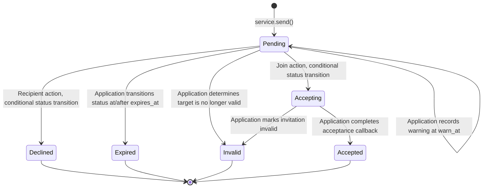
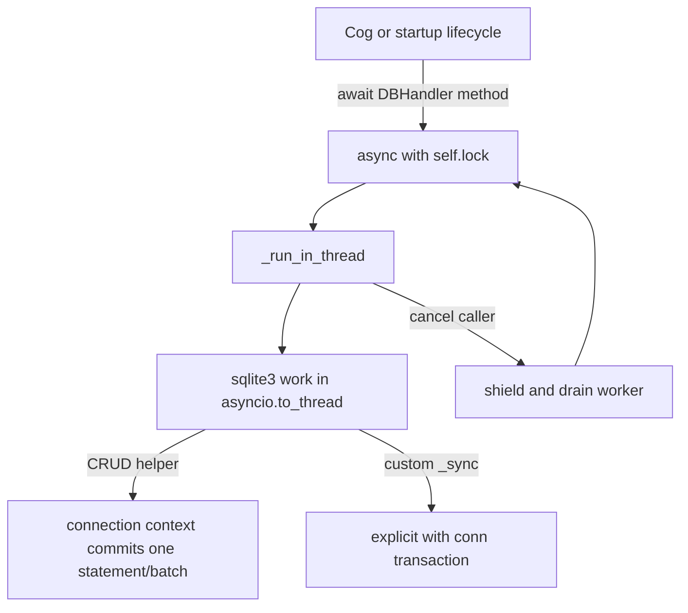
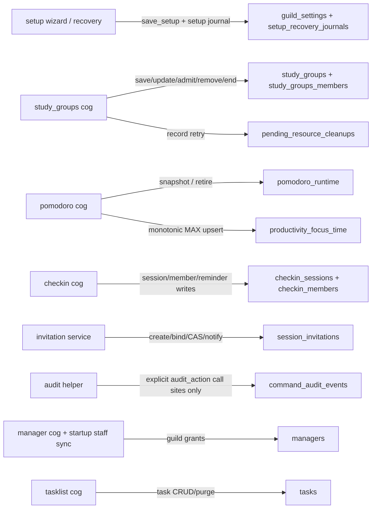

# Chief Productivity Officer (CPO) — Database Architecture & Data Dictionary

Source-derived map of the CPO SQLite persistence tier. This document distinguishes observed behavior from intended invariants and records the audited source snapshot; open defects below mean the runtime is not deployment-ready.

---

## 1. Persistence Tier Overview & Invariants

The CPO persistence layer is a single `sqlite3.Connection` (`check_same_thread=False`) wrapped by asynchronous `DBHandler` methods. Each DAL operation uses one `asyncio.Lock` and dispatches synchronous SQLite work with `asyncio.to_thread`; cancellation of a caller is shielded until the worker finishes. The lock serializes this process's operations. It does not prove cross-process serialization or eliminate SQLite lock errors caused by external writers.

### Core Architectural Invariants

1. **Process-local serialization**: Public DAL methods acquire `self.lock` around SQLite worker calls. This serializes access through this `DBHandler` instance; it is not a cross-process lock and does not guarantee that SQLite can never report a lock error.
2. **Worker completion on cancellation**: `_run_in_thread` shields the worker and drains it before propagating cancellation, so the surrounding DAL lock remains held until the SQLite call finishes.
3. **Bound values**: Query values use SQLite parameters. A few update statements construct the column-assignment list from fixed, code-owned field names; values remain bound parameters.
4. **Startup schema preparation**: `connect()` calls `create_tables()`. It creates the current tables, conditionally adds columns, renames two legacy tables when their replacements are absent, backfills identifiers and task guild IDs, and normalizes manager grants. The migration routine commits after manager normalization and again at the end; the complete migration is not one atomic transaction. No table-drop statement appears in this routine.
5. **Guild keys are unevenly applied**: Settings, check-in sessions/settings, invitation transitions, audit rows, Pomodoro runtime saves, and manager grants have guild keys. Several group/task lookups deliberately accept only a group/user identifier and are not independently guild-scoped. Do not infer a universal cross-guild isolation guarantee from the schema.

---

## 2. Entity-Relationship (ER) Diagram

---

## 3. Detailed Data Dictionary

### 3.1 Server Settings & Governance

#### `guild_settings`
Stores server-specific productivity suite configuration, resource boundaries, default durations, and assigned operational channels.
| Column | Type | Nullable | Default | Description |
| :--- | :--- | :--- | :--- | :--- |
| `guild_id` | `INTEGER` | No | None | Discord Guild ID (Primary Key). |
| `vc_cleanup_time` | `INTEGER` | Yes | `600` | Inactivity grace period in seconds before empty VCs are purged. |
| `vc_category_id` | `INTEGER` | Yes | `NULL` | Legacy category ID for dynamic voice channels. |
| `group_category_id` | `INTEGER` | Yes | `NULL` | Category channel ID hosting study group rooms. |
| `commands_channel_id` | `INTEGER` | Yes | `NULL` | Dedicated text channel ID for public bot slash interaction replies. |
| `default_vc_id` | `INTEGER` | Yes | `NULL` | Default lounge/lobby VC ID for members relocated during video enforcement. |
| `default_role_id` | `INTEGER` | Yes | `NULL` | Mandatory access role ID required to interact with CPO commands (nullable = unrestricted). |
| `default_max_members` | `INTEGER` | Yes | `10` | Default capacity limit assigned to newly provisioned study groups. |
| `mod_log_channel_id` | `INTEGER` | Yes | `NULL` | Moderator channel ID where audit embeds and lifecycle events are logged. |
| `default_group_duration` | `INTEGER` | No | `86400` | Lifetime in seconds for study groups (default 24h). |
| `default_pomodoro_duration`| `INTEGER` | No | `86400` | Lifetime in seconds for Pomodoro sessions (default 24h). |

#### `checkin_guild_settings`
Stores validated per-guild check-in policies, intervals, and permission boundaries.
| Column | Type | Nullable | Default | Description |
| :--- | :--- | :--- | :--- | :--- |
| `guild_id` | `INTEGER` | No | None | Discord Guild ID (Primary Key). |
| `state_json` | `TEXT` | No | None | Serialized JSON containing boundaries: `max_members`, `min_duration`, `max_duration`, `max_absences`, `max_breaks`, `max_user_sessions`, `permission_mode`, and allow/deny lists. |
| `updated_at` | `TEXT` | No | `CURRENT_TIMESTAMP` | ISO-8601 timestamp of latest configuration commit. |

#### `managers`
Stores administrative role grants for CPO's authorization hierarchy.
| Column | Type | Nullable | Default | Description |
| :--- | :--- | :--- | :--- | :--- |
| `id` | `INTEGER` | No | Auto | Surrogate Primary Key. |
| `user_id` | `INTEGER` | No | None | Discord User Snowflake. |
| `guild_id` | `INTEGER` | Yes | `NULL` | Discord Guild Snowflake (NULL = global legacy, integer = guild-scoped). |
| `permission_level` | `INTEGER` | No | None | Numerical permission tier (Tier 3 = Manager, Tier 4 = Developer). |
| `grant_source` | `TEXT` | No | `'explicit'` | Provenance of grant: `'explicit'` (slash command) or `'server_sync'` (Discord permission sync). |

*Indexes*: `idx_managers_user_guild` ON `(user_id, IFNULL(guild_id, -1))` (UNIQUE).

---

### 3.2 Study Groups & Members

#### `study_groups`
Core registry of persistent study rooms, associated Discord resources, and runtime voice flags.
| Column | Type | Nullable | Default | Description |
| :--- | :--- | :--- | :--- | :--- |
| `id` | `INTEGER` | No | Auto | Numerical Primary Key (legacy identity). |
| `guild_id` | `INTEGER` | No | None | Discord Guild Snowflake. |
| `name` | `TEXT` | No | None | Sanitized name of the study cohort. |
| `group_id` | `TEXT` | No | None | Canonical UUID string identifier (Unique). |
| `creator_id` | `INTEGER` | No | None | Discord User ID of original creator. |
| `owner_id` | `INTEGER` | No | None | Discord User ID of current group owner. |
| `category_id` | `INTEGER` | No | None | Discord Category Channel ID housing this group. |
| `max_members` | `INTEGER` | No | None | Roster capacity limit. |
| `group_role_id` | `INTEGER` | Yes | `0` | Dedicated Discord Role ID provisioned for this group. |
| `vc_id` | `INTEGER` | Yes | `0` | Dedicated Discord Voice Channel ID. |
| `text_id` | `INTEGER` | Yes | `0` | Dedicated Discord Text Channel ID. |
| `info_embed_id` | `INTEGER` | Yes | `0` | Discord Message ID of pinned group dashboard embed. |
| `speak_enabled` | `BOOLEAN` | Yes | `1` | Voice speak permission toggle for members. |
| `video_mode` | `TEXT` | Yes | `'off'` | Video enforcement mode (`'off'` or `'force'`). |
| `video_timer` | `INTEGER` | Yes | `10` | Video enforcement timer period in minutes. |
| `start_time` | `REAL` | No | None | Epoch timestamp when group was provisioned. |
| `end_time` | `REAL` | No | None | Epoch timestamp when group will expire. |
| `duration` | `INTEGER` | No | None | Scheduled lifespan in seconds. |
| `active` | `BOOLEAN` | Yes | `0` | Operational status (`1` = active, `0` = terminated/ended). |

*Indexes*: `idx_study_groups_group_id` ON `(group_id)` (UNIQUE).

#### `study_groups_members`
Junction table tracking group membership rosters.
| Column | Type | Nullable | Default | Description |
| :--- | :--- | :--- | :--- | :--- |
| `group_id` | `INTEGER` | No | None | Declared SQLite affinity is INTEGER; current code writes canonical group ID strings. The DDL declares a foreign key to `study_groups.group_id`, but connection setup does not enable FK enforcement. |
| `user_id` | `INTEGER` | No | None | Discord User Snowflake. |

*Primary Key*: `(group_id, user_id)`.

---

### 3.3 Pomodoro & Productivity Tracking

#### `pomodoro_sessions`
Historical registry of Pomodoro configurations attached to study groups.
| Column | Type | Nullable | Default | Description |
| :--- | :--- | :--- | :--- | :--- |
| `id` | `INTEGER` | No | Auto | Primary Key. |
| `group_id` | `INTEGER` | Yes | `NULL` | Study group ID (Foreign Key -> `study_groups.id`). |
| `start_time` | `REAL` | Yes | `NULL` | Epoch timestamp of session start. |
| `end_time` | `REAL` | Yes | `NULL` | Epoch timestamp of session expiration. |
| `focus_duration` | `INTEGER` | Yes | `NULL` | Focus interval in minutes. |
| `short_break_duration`| `INTEGER` | Yes | `NULL` | Short break interval in minutes. |
| `long_break_duration` | `INTEGER` | Yes | `NULL` | Long break interval in minutes. |

#### `pomodoro_runtime`
Live runtime snapshot table powering crash recovery and stage hydration across restarts.
| Column | Type | Nullable | Default | Description |
| :--- | :--- | :--- | :--- | :--- |
| `session_key` | `TEXT` | No | None | Unique tracking string (`group_id:tracking_id`) (Primary Key). |
| `group_id` | `TEXT` | No | None | Canonical group UUID or tracking ID. |
| `guild_id` | `INTEGER` | No | None | Discord Guild Snowflake. |
| `state_json` | `TEXT` | No | None | Serialized runtime state: phase, time left, cycle count, participants, paused state, stage deadlines. |
| `active` | `INTEGER` | No | `1` | Operational flag (`1` = active, `0` = closed). |

#### `productivity_focus_time`
Monotonic attended focus seconds tracked for opted-in participants in active Pomodoro voice sessions.
| Column | Type | Nullable | Default | Description |
| :--- | :--- | :--- | :--- | :--- |
| `session_id` | `TEXT` | No | None | Tracking UUID of Pomodoro session. |
| `user_id` | `INTEGER` | No | None | Discord User Snowflake. |
| `guild_id` | `INTEGER` | No | None | Discord Guild Snowflake. |
| `group_id` | `TEXT` | No | None | Associated Study Group ID. |
| `focus_seconds` | `REAL` | No | None | Cumulative attended focus time in seconds (CHECK: `>= 0`). |

*Primary Key*: `(session_id, user_id)`.

---

### 3.4 Check-in Standup Module

#### `checkin_sessions`
Active and historical daily standup check-in sessions.
| Column | Type | Nullable | Default | Description |
| :--- | :--- | :--- | :--- | :--- |
| `id` | `INTEGER` | No | Auto | Primary Key. |
| `session_id` | `TEXT` | No | None | Canonical UUID string identifier (Unique). |
| `guild_id` | `INTEGER` | No | None | Discord Guild Snowflake. |
| `name` | `TEXT` | No | None | Display title of check-in session. |
| `creator_id` | `INTEGER` | No | None | Discord User ID of creator. |
| `owner_id` | `INTEGER` | No | None | Discord User ID of active owner. |
| `text_id` | `INTEGER` | No | None | Discord Text Channel ID where reminders and buttons appear. |
| `duration` | `INTEGER` | No | None | Lifespan in minutes. |
| `start_time` | `REAL` | No | None | Epoch start timestamp. |
| `last_reminder_time` | `REAL` | No | None | Epoch timestamp of previous reminder post. |
| `next_reminder_time` | `REAL` | No | None | Epoch timestamp of scheduled upcoming reminder. |
| `reminder_count` | `INTEGER` | No | None | Total reminders dispatched. |
| `last_reminder_message_id`| `INTEGER` | Yes | `NULL`| Discord Message ID of active interactive reminder view. |
| `active` | `BOOLEAN` | Yes | `1` | Operational status (`1` = active, `0` = ended). |

#### `checkin_members`
Roster and attendance states for check-in participants.
| Column | Type | Nullable | Default | Description |
| :--- | :--- | :--- | :--- | :--- |
| `session_id` | `TEXT` | No | None | Check-in UUID (Foreign Key -> `checkin_sessions.session_id`). |
| `member_id` | `INTEGER` | No | None | Discord User Snowflake. |
| `status` | `TEXT` | No | None | Attendance status (`'present'`, `'absent'`, `'break'`, `'exited'`). |
| `absences` | `INTEGER` | Yes | `0` | Consecutive missed check-in counts. |

*Primary Key*: `(session_id, member_id)`.

---

### 3.5 Tasks & Personal Productivity

#### `tasks`
Personal and group task management records.
| Column | Type | Nullable | Default | Description |
| :--- | :--- | :--- | :--- | :--- |
| `id` | `INTEGER` | No | Auto | Primary Key. |
| `user_id` | `INTEGER` | No | None | Discord User Snowflake. |
| `description` | `TEXT` | No | None | Text content of task item. |
| `completed` | `BOOLEAN` | No | `0` | Completion status (`1` = completed, `0` = pending). |
| `created_at` | `TIMESTAMP` | Yes | `CURRENT_TIMESTAMP` | Creation timestamp. |
| `group_id` | `TEXT` | Yes | `NULL` | Associated study group UUID (NULL = personal task). |
| `task_id_str` | `TEXT` | Yes | `NULL` | Public alphanumeric task reference identifier. |
| `task_number` | `INTEGER` | Yes | `NULL` | User/group-scoped monotonic sequence number. |
| `guild_id` | `INTEGER` | Yes | `NULL` | Discord Guild Snowflake (NULL = DM personal task). |

---

### 3.6 Durable Invitations & Security Audit

#### `session_invitations`
Durable recipient invitation registry. `warn_at` and `expires_at` are stored deadlines; SQLite does not enforce them automatically.
| Column | Type | Nullable | Default | Description |
| :--- | :--- | :--- | :--- | :--- |
| `invitation_id` | `TEXT` | No | None | UUID string identifier (Primary Key). |
| `guild_id` | `INTEGER` | No | None | Discord Guild Snowflake. |
| `session_kind` | `TEXT` | No | None | Target session type: `'group'`, `'checkin'`, or `'pomodoro'`. |
| `session_id` | `TEXT` | No | None | Identifier of target study group or session. |
| `recipient_id` | `INTEGER` | No | None | Discord User Snowflake of invited recipient. |
| `owner_id` | `INTEGER` | No | None | Discord User Snowflake of session owner. |
| `dm_channel_id` | `INTEGER` | Yes | `NULL` | Discord DM Channel Snowflake where invite was sent. |
| `dm_message_id` | `INTEGER` | Yes | `NULL` | Discord Message Snowflake holding the interactive View. |
| `created_at` | `REAL` | No | None | Epoch timestamp when invitation was dispatched. |
| `warn_at` | `REAL` | No | None | Epoch timestamp (created + 360s) for impending expiry warning. |
| `expires_at` | `REAL` | No | None | Epoch timestamp (created + 600s) of absolute hard expiration. |
| `status` | `TEXT` | No | `'pending'` | Lifecycle state: `'pending'`, `'accepting'`, `'accepted'`, `'declined'`, `'expired'`, `'invalid'`. |
| `warned` | `INTEGER` | No | `0` | Boolean flag (1/0) indicating 6-minute warning was sent. |
| `expiry_notified` | `INTEGER` | No | `0` | Boolean flag (1/0) indicating 10-minute expiry DM was sent. |

*Indexes*: `idx_invitations_pending` ON `(status, expires_at)`.

#### `command_audit_events`
Guild-scoped audit-event table intended for command and authorization records. The schema does not enforce immutability or completeness.
| Column | Type | Nullable | Default | Description |
| :--- | :--- | :--- | :--- | :--- |
| `id` | `INTEGER` | No | Auto | Primary Key. |
| `guild_id` | `INTEGER` | No | None | Discord Guild Snowflake. |
| `actor_id` | `INTEGER` | No | None | Discord User Snowflake invoking the command/button. |
| `actor_tier` | `INTEGER` | No | None | Evaluated permission tier (0=User, 1=Member, 2=Owner, 3=Manager, 4=Developer, 5=Supreme Commander). |
| `target_ids` | `TEXT` | No | None | JSON array or comma-separated target resource/session IDs. |
| `action` | `TEXT` | No | None | Standardized action identifier (e.g. `'invitation.send'`, `'setup.save'`). |
| `outcome` | `TEXT` | No | None | Authorization/execution outcome: `'invoked'`, `'succeeded'`, `'failed'`, `'denied'`. |
| `occurred_at` | `REAL` | No | None | Epoch timestamp of event occurrence. |

*Indexes*: `idx_audit_guild` ON `(guild_id, id)`.

---

### 3.7 Resilient Recovery & Teardown

#### `setup_recovery_journals`
Write-Ahead Journal (WAL) for atomic multi-stage `/setup` guild provisioning and crash recovery.
| Column | Type | Nullable | Default | Description |
| :--- | :--- | :--- | :--- | :--- |
| `guild_id` | `INTEGER` | No | None | Discord Guild Snowflake (Primary Key). |
| `operation_id` | `TEXT` | No | None | Unique operation UUID string. |
| `owner_id` | `INTEGER` | No | None | Discord User ID of administrator executing setup. |
| `phase` | `TEXT` | No | `'prepared'`| Operational stage: `'prepared'`, `'committed'`, `'sync_pending'`. |
| `state_json` | `TEXT` | No | None | Full snapshot: created resources, moved channels, original category overwrites, rollback targets. |
| `last_error` | `TEXT` | Yes | `NULL` | Diagnostics string if intermediate REST or SQL failed. |
| `created_at` | `TEXT` | No | `CURRENT_TIMESTAMP` | Timestamp of setup initialization. |
| `updated_at` | `TEXT` | No | `CURRENT_TIMESTAMP` | Timestamp of latest journal mutation. |

*Indexes*: `idx_setup_recovery_phase` ON `(phase)`.

#### `pending_resource_cleanups`
Persistent FIFO queue tracking uncleaned Discord resources left behind due to permission denials or Discord outages.
| Column | Type | Nullable | Default | Description |
| :--- | :--- | :--- | :--- | :--- |
| `id` | `INTEGER` | No | Auto | Primary Key. |
| `guild_id` | `INTEGER` | No | None | Discord Guild Snowflake. |
| `group_id` | `TEXT` | No | None | Associated Study Group UUID. |
| `resource_type` | `TEXT` | No | None | Target type (`'channel'`, `'role'`, `'category'`). |
| `resource_id` | `INTEGER` | No | None | Discord Resource Snowflake. |
| `retry_count` | `INTEGER` | No | `0` | Number of deletion re-attempts. |
| `last_error` | `TEXT` | Yes | `NULL` | Last exception or error code encountered. |
| `created_at` | `TIMESTAMP` | Yes | `CURRENT_TIMESTAMP` | Initial enqueue timestamp. |
| `last_attempt_at`| `TIMESTAMP` | Yes | `NULL` | Most recent retry timestamp. |
| `status` | `TEXT` | No | `'pending'` | Queue state (`'pending'`, `'processing'`, `'completed'`, `'failed'`). |

*Indexes*: `idx_cleanup_pending` ON `(status, guild_id)`.

---

## 4. Lifecycle & State Machine Diagrams

### 4.1 Durable Invitation State Machine

### 4.2 Setup Recovery Journal State Machine

```mermaid
stateDiagram-v2
    [*] --> Prepared: Admin stages settings in /setup wizard
    note right of Prepared: Intents recorded before Discord mutations
    
    Prepared --> Committed: SQLite settings write succeeds
    note right of Committed: This phase is stored; setup settings and phase commit together
    
    Prepared --> [*]: Rollback/cancel path restores resources then deletes journal
    Committed --> SyncPending: Staff role sync fails; retry work remains durable
    Committed --> [*]: Sync succeeds and journal is deleted
    SyncPending --> [*]: Retry succeeds and journal is deleted
    note right of SyncPending: Complete and rolled-back are not stored phase values
```

---

## 5. Security & Isolation Matrix

The matrix below describes the intended authorization policy from repository rules. It is not evidence that every command currently enforces it; AUTH-01/AUTH-02 and other audit findings remain open.

| Capability | Tier 0: User | Tier 1: Member | Tier 2: Owner | Tier 3: Manager | Tier 4: Bot Dev | Tier 5: Supreme Commander |
| :--- | :---: | :---: | :---: | :---: | :---: | :---: |
| Scope | Guild | Channel | Group | Guild | Guild | Global (`.env`) |
| View / Use Commands | Subject to Default Role | Subject to Default Role | Subject to Default Role | Subject to Default Role | Subject to Default Role | Subject to Default Role |
| Create Study Group | ✅ (max 3) | ✅ (max 3) | ✅ (max 3) | ✅ (Unrestricted) | ✅ (Unrestricted) | ✅ (Unrestricted) |
| Manage Group Settings| ❌ | ❌ | ✅ | ✅ | ✅ | ✅ |
| Run /setup Wizard | ❌ | ❌ | ❌ | ✅ | ✅ | ✅ |
| Bypass Default Role | ❌ | ❌ | ❌ | ❌ (Strict Gate)| ❌ (Strict Gate) | ❌ (Strict Gate) |
| Global Configuration| ❌ | ❌ | ❌ | ❌ | ❌ | ✅ (`BOT_DEVELOPER_ID`) |

## 6. Audited DAL catalogue and runtime relationships

### 6.1 `DBHandler` surface (current source)

The following catalogue covers all 99 methods in `database.py` at the fingerprint below. The four synchronous helpers are worker-only primitives; `validate_checkin_settings` is a pure validator.

| Area | Methods and observed responsibility |
| :--- | :--- |
| Connection and primitives | `__init__`, `_run_in_thread`, `_fetchone_sync`, `_fetchall_sync`, `_execute_commit_sync`, `_executemany_commit_sync`, `connect`, `close`, `create_tables` |
| Guild configuration | `set_mod_log_channel`, `get_mod_log_channel`, `get_commands_channel`, `get_default_vc`, `update_vc_cleanup_time`, `get_vc_cleanup_time`, `update_vc_category`, `get_vc_category`, `update_group_category`, `get_group_category`, `update_default_max_members`, `get_default_max_members`, `get_default_group_duration`, `get_default_pomodoro_duration`, `save_setup`, `get_default_role` |
| Check-in policy persistence | `validate_checkin_settings`, `save_checkin_guild_settings`, `get_checkin_guild_settings`, `get_checkin_settings_guild_ids` |
| Study-group records/resources | `save_study_group`, `update_study_group_by_id`, `get_user_created_group_count`, `get_user_joined_group_count`, `get_user_group`, `get_study_group_by_channel`, `fetch_study_group_by_name`, `fetch_study_group_by_id`, `add_member_to_study_group_db`, `remove_member_from_study_group_db`, `transfer_ownership_study_group_db`, `fetch_members_of_group`, `fetch_owner_of_group`, `delete_study_group`, `get_study_groups_of_user`, `get_all_study_groups_of_guild`, `get_guild_group_names`, `get_all_study_groups`, `get_study_group`, `update_group_roles`, `get_group_roles`, `update_voice_channel`, `log_vc_creation`, `get_vc_logs` |
| Check-in runtime records | `save_checkin_session`, `update_checkin_session`, `fetch_checkin_session`, `add_or_update_checkin_member`, `fetch_checkin_members`, `fetch_active_checkin_sessions`, `delete_checkin_session` |
| Pomodoro and focus | `save_pomodoro_session`, `save_pomodoro_runtime`, `get_active_pomodoro_runtime`, `retire_pomodoro_runtime`, `retire_group_pomodoro_runtime`, `save_productivity_focus_time`, `get_session_productivity_focus_seconds`, `get_productivity_focus_seconds` |
| Invitations and audit | `create_session_invitation`, `get_session_invitation`, `get_pending_session_invitations`, `bind_session_invitation_message`, `transition_session_invitation`, `mark_invitation_notification`, `record_command_audit`, `get_command_audit_events` |
| Setup recovery and teardown retry | `create_setup_recovery_journal`, `get_setup_recovery_journal`, `update_setup_recovery_journal`, `delete_setup_recovery_journal`, `record_pending_cleanup`, `get_pending_cleanups`, `update_cleanup_retry`, `delete_pending_cleanup`, `get_pending_cleanup_count` |
| Managers | `add_manager`, `sync_guild_manager_grants`, `remove_manager`, `get_manager`, `get_all_managers` |
| Tasks | `add_task`, `complete_task`, `apply_task_action`, `get_user_tasks`, `delete_task`, `purge_group_tasks`, `purge_guild_tasks`, `purge_personal_tasks`, `purge_all_user_tasks` |

### 6.2 Lock, transaction, and migration boundaries

Ordinary writes route through `_execute_commit_sync` or `_executemany_commit_sync`, each using `with self.conn`; custom multi-statement transactions use a worker closure with `with self.conn` (notably setup save/journal phase commit, group save, group soft-delete/roster/runtime retirement, Pomodoro runtime save, focus-time monotonic upsert, manager sync, and cleanup enqueue). Read helpers execute without opening an explicit read transaction. `create_tables()` performs its schema work in one worker under the lock, but explicitly commits partway through and at completion. SQLite foreign-key declarations exist in the DDL, but `connect()` does not enable `PRAGMA foreign_keys=ON`; enforcement should not be assumed from the declarations alone.

### 6.3 Runtime callers and persistence ownership

Groups are the root durable Discord-resource registry and are marked inactive by `delete_study_group`; this operation also deletes their member rows and retires matching Pomodoro runtime snapshots. It does not delete the group row. Check-in sessions persist owner identity, schedule/reminder counters and message ID; members persist status/absence counters. The current check-in update method does not write `owner_id`, despite that column existing. Pomodoro session configuration is stored in `pomodoro_sessions`; restartable live state is a JSON snapshot in `pomodoro_runtime`; focus totals are separately persisted as per-user rows and use `MAX(existing, incoming)` to avoid decreasing an already stored value. Tasks are user-owned with optional guild and group columns; `NULL` guild/group denotes personal context in the matching query paths.

### 6.4 Actual scoping constraints

| Data/path | Scope enforced by these DAL queries | Caveat |
| :--- | :--- | :--- |
| `guild_settings`, `checkin_guild_settings` | `guild_id` key | Per-guild upsert/read. |
| Study-group by channel/name and group lists | channel or supplied guild; lists include guild | `fetch_study_group_by_id`, membership changes, owner transfer, member reads, delete, and some counters take no guild. Callers must establish guild ownership. `get_user_group` may fall back to any active group for a user when channel-specific lookup misses. |
| `managers` | explicit `(user_id, guild_id)` lookups; `sync_guild_manager_grants` replaces only `server_sync` grants for one guild | Legacy nullable guild rows may exist; `get_manager` itself does not return them for a concrete guild. |
| `tasks` | depends on method/arguments | `get_user_tasks(user_id)` without `guild_id` is user-wide. Completion/deletion without `group_id` is user-only and may cross guild/group context. `purge_all_user_tasks` is intentionally global. |
| Check-in sessions/settings and audit events | session ID or guild ID as appropriate | `fetch_checkin_session` and member CRUD use session ID without a second guild predicate; audit reads are guild-filtered. |
| Invitations | guild and invitation ID on read/transitions; pending list is guild-filtered | Pending state is durable but startup restoration is absent in audited runtime. |
| Pomodoro runtime/focus | save runtime verifies `(group_id, guild_id)` and active group; focus read/write carries guild and group | Runtime retire-by-session key is global; retire-by-group uses group ID only. Focus aggregate requires a concrete matching guild (`guild_id = ?`). |
| Pending cleanup | optionally guild-filtered retrieval | Duplicate detection during enqueue checks `resource_id` and pending status without guild predicate. |
| Setup journal | guild and operation ID | Guild primary key means at most one journal per guild. |

### 6.5 Open persistence and consistency findings (audited source)

These are unresolved findings from `.audit-function-review-20261005/AUDIT_REPORT.md`; this document describes the audited pre-fix runtime and does not treat proposed fixes or older tests as verification.

- **INV-01/02/03 (P1):** invitation eligibility grants access when role-settings lookup errors; failed invitation CAS/create can still invoke acceptance behavior; startup does not restore pending invitation views/deadline tasks even though `get_pending_session_invitations` exists.
- **AUD-01 (P1):** the persistent audit table and `record_command_audit` exist, but general commands and controls do not consistently reach the audit helper.
- **CHECK-01 (P1):** check-in owner selection updates memory without a corresponding DAL owner write; selector authority is not revalidated.
- **POMO-02 (P1):** a Pomodoro persistence helper swallows a save error, so callers can interpret a failed durable write as success.
- **GROUP-01 (P1):** partial Discord group provisioning can leave role/text resources without a durable group row or full rollback. DAL group persistence cannot account for resources never recorded.
- **ARC-12 (P2):** Pomodoro attendance, dashboard/retirement paths, and gateway lifecycle changes bypass the per-session lock in portions of the runtime. DAL serialization only protects individual SQLite operations, not the wider in-memory-to-database state transition.
- **VOTE-02/04 and VOTE-05 (P1):** ownership-transfer/removal flows can leave memory/SQLite roster state inconsistent on failures, and a votekick fallback can resolve a group from another guild. These are caller-level multi-write consistency/scoping defects; the DAL's group-ID-only update signatures make caller validation material.
- **SEC-10 (P1):** group named-join currently permits admission without a durable invitation; the membership insert itself enforces active group and capacity but not invitation ownership.

The broader audit also found fail-open/missing-manager authorization branches (AUTH-01), manager tier overwrite/removal (AUTH-02), UI limits, and other non-DAL defects. These are documented here only where they affect persistence ownership or scoping.

### 6.6 Evidence and status

- Audited source baseline: branch `antigravity-fix`, HEAD `f9a39815354fe3f60208513f867b1502b42fb193`, with the dirty working tree described in the report.
- `database.py` SHA-256 at mapping time: `7e28d54f71ef91a76d27adb1b21b477d8ebd0d38da4c576b9be045e2e432f439` (matches `.audit-function-review-20261005/snapshot.json`). Other source fingerprints are recorded in that snapshot; they must be refreshed after coding/debugger changes.
- Audit reviewed 1008/1008 function bodies, 50/50 lambda expressions, and 83/83 executable module statements in 49 first-party executable files. This is static source review, not dynamic Discord validation.
- The audit report records offline pytest, Mypy, Ruff, and whitespace checks for the reviewed snapshot. Package build and target Python 3.11.17 CI remain unverified; mapping work does not establish deployment readiness.
