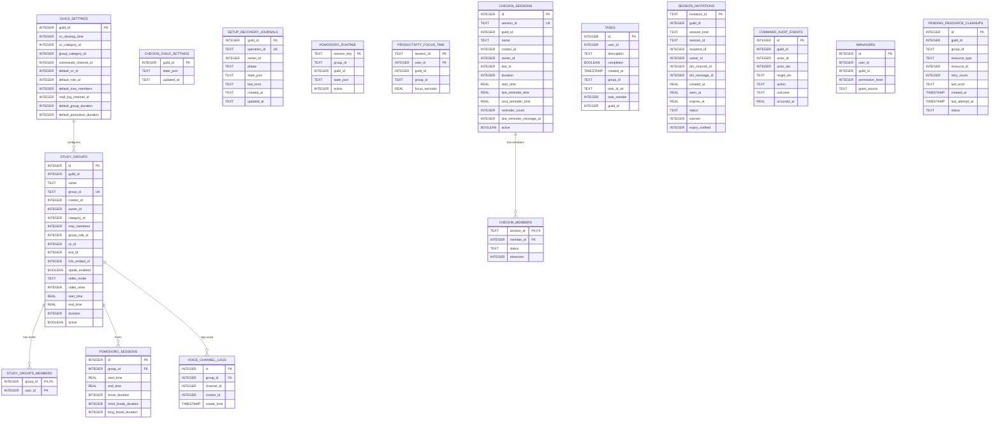
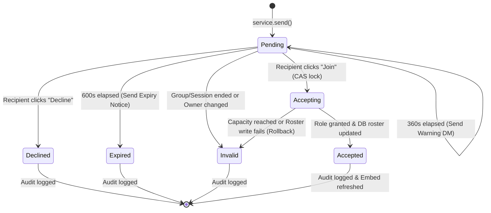

# Chief Productivity Officer (CPO) — Database Architecture & Data Dictionary

Comprehensive technical documentation of the CPO SQLite persistence tier, data modeling, concurrency invariants, migration guarantees, and audit subsystems.

---

## 1. Persistence Tier Overview & Invariants

The **Chief Productivity Officer (CPO)** persistence layer is built on a hardened SQLite 3 asynchronous DAL (`database.py:DBHandler`). Because standard SQLite drivers in Python (`sqlite3`) are synchronous and thread-affine, the architecture enforces strict thread-isolation and concurrency guardrails.

### Core Architectural Invariants

1. **Serialized Async Concurrency (`async with self.lock`)**:
   - Every read and write transaction MUST acquire `asyncio.Lock` before dispatching to worker threads.
   - Prevents `sqlite3.OperationalError: database is locked` across concurrent slash command handlers.
2. **Dedicated Worker Thread Dispatch (`_run_in_thread`)**:
   - Heavy disk I/O and SQL executions are dispatched to worker threads via `asyncio.to_thread` or thread pools.
   - In-flight worker threads are shielded from cancellation: if an `asyncio.CancelledError` occurs, the DAL awaits the completion of the active worker before releasing the lock to prevent dangling cursors or corrupted shared state.
3. **Parameterized SQL Queries**:
   - 100% of queries use `?` placeholders. String formatting (f-strings) or concatenations are strictly forbidden to eliminate SQL injection risks.
4. **Additive Migrations & Zero Data Loss**:
   - `create_tables()` runs idempotently at bot startup.
   - Legacy schemas are transformed in-place using `ALTER TABLE ADD COLUMN` with safe defaults.
   - Tables are never dropped in production (`DROP TABLE` is strictly prohibited).
5. **Guild Isolation**:
   - All settings, rosters, sessions, journals, and audit records are strictly scoped by Discord snowflake `guild_id`.
   - Cross-guild bleed is physically impossible by query construction.

---

## 2. Entity-Relationship (ER) Diagram

---

## 3. Detailed Data Dictionary

### 3.1 Server Settings & Governance

#### `guild_settings`
Stores server-specific productivity suite configuration, resource boundaries, default durations, and assigned operational channels.
| Column | Type | Nullable | Default | Description |
| :--- | :--- | :--- | :--- | :--- |
| `guild_id` | `INTEGER` | No | None | Discord Guild ID (Primary Key). |
| `vc_cleanup_time` | `INTEGER` | Yes | `600` | Inactivity grace period in seconds before empty VCs are purged. |
| `vc_category_id` | `INTEGER` | Yes | `NULL` | Legacy category ID for dynamic voice channels. |
| `group_category_id` | `INTEGER` | Yes | `NULL` | Category channel ID hosting study group rooms. |
| `commands_channel_id` | `INTEGER` | Yes | `NULL` | Dedicated text channel ID for public bot slash interaction replies. |
| `default_vc_id` | `INTEGER` | Yes | `NULL` | Default lounge/lobby VC ID for members relocated during video enforcement. |
| `default_role_id` | `INTEGER` | Yes | `NULL` | Mandatory access role ID required to interact with CPO commands (nullable = unrestricted). |
| `default_max_members` | `INTEGER` | Yes | `10` | Default capacity limit assigned to newly provisioned study groups. |
| `mod_log_channel_id` | `INTEGER` | Yes | `NULL` | Moderator channel ID where audit embeds and lifecycle events are logged. |
| `default_group_duration` | `INTEGER` | No | `86400` | Lifetime in seconds for study groups (default 24h). |
| `default_pomodoro_duration`| `INTEGER` | No | `86400` | Lifetime in seconds for Pomodoro sessions (default 24h). |

#### `checkin_guild_settings`
Stores validated per-guild check-in policies, intervals, and permission boundaries.
| Column | Type | Nullable | Default | Description |
| :--- | :--- | :--- | :--- | :--- |
| `guild_id` | `INTEGER` | No | None | Discord Guild ID (Primary Key). |
| `state_json` | `TEXT` | No | None | Serialized JSON containing boundaries: `max_members`, `min_duration`, `max_duration`, `max_absences`, `max_breaks`, `max_user_sessions`, `permission_mode`, and allow/deny lists. |
| `updated_at` | `TEXT` | No | `CURRENT_TIMESTAMP` | ISO-8601 timestamp of latest configuration commit. |

#### `managers`
Stores administrative role grants for CPO's authorization hierarchy.
| Column | Type | Nullable | Default | Description |
| :--- | :--- | :--- | :--- | :--- |
| `id` | `INTEGER` | No | Auto | Surrogate Primary Key. |
| `user_id` | `INTEGER` | No | None | Discord User Snowflake. |
| `guild_id` | `INTEGER` | Yes | `NULL` | Discord Guild Snowflake (NULL = global legacy, integer = guild-scoped). |
| `permission_level` | `INTEGER` | No | None | Numerical permission tier (Tier 3 = Manager, Tier 4 = Developer). |
| `grant_source` | `TEXT` | No | `'explicit'` | Provenance of grant: `'explicit'` (slash command) or `'server_sync'` (Discord permission sync). |

*Indexes*: `idx_managers_user_guild` ON `(user_id, IFNULL(guild_id, -1))` (UNIQUE).

---

### 3.2 Study Groups & Members

#### `study_groups`
Core registry of persistent study rooms, associated Discord resources, and runtime voice flags.
| Column | Type | Nullable | Default | Description |
| :--- | :--- | :--- | :--- | :--- |
| `id` | `INTEGER` | No | Auto | Numerical Primary Key (legacy identity). |
| `guild_id` | `INTEGER` | No | None | Discord Guild Snowflake. |
| `name` | `TEXT` | No | None | Sanitized name of the study cohort. |
| `group_id` | `TEXT` | No | None | Canonical UUID string identifier (Unique). |
| `creator_id` | `INTEGER` | No | None | Discord User ID of original creator. |
| `owner_id` | `INTEGER` | No | None | Discord User ID of current group owner. |
| `category_id` | `INTEGER` | No | None | Discord Category Channel ID housing this group. |
| `max_members` | `INTEGER` | No | None | Roster capacity limit. |
| `group_role_id` | `INTEGER` | Yes | `0` | Dedicated Discord Role ID provisioned for this group. |
| `vc_id` | `INTEGER` | Yes | `0` | Dedicated Discord Voice Channel ID. |
| `text_id` | `INTEGER` | Yes | `0` | Dedicated Discord Text Channel ID. |
| `info_embed_id` | `INTEGER` | Yes | `0` | Discord Message ID of pinned group dashboard embed. |
| `speak_enabled` | `BOOLEAN` | Yes | `1` | Voice speak permission toggle for members. |
| `video_mode` | `TEXT` | Yes | `'off'` | Video enforcement mode (`'off'` or `'force'`). |
| `video_timer` | `INTEGER` | Yes | `10` | Video enforcement timer period in minutes. |
| `start_time` | `REAL` | No | None | Epoch timestamp when group was provisioned. |
| `end_time` | `REAL` | No | None | Epoch timestamp when group will expire. |
| `duration` | `INTEGER` | No | None | Scheduled lifespan in seconds. |
| `active` | `BOOLEAN` | Yes | `0` | Operational status (`1` = active, `0` = terminated/ended). |

*Indexes*: `idx_study_groups_group_id` ON `(group_id)` (UNIQUE).

#### `study_groups_members`
Junction table tracking group membership rosters.
| Column | Type | Nullable | Default | Description |
| :--- | :--- | :--- | :--- | :--- |
| `group_id` | `TEXT` | No | None | Study group UUID string (Foreign Key -> `study_groups.group_id`). |
| `user_id` | `INTEGER` | No | None | Discord User Snowflake. |

*Primary Key*: `(group_id, user_id)`.

---

### 3.3 Pomodoro & Productivity Tracking

#### `pomodoro_sessions`
Historical registry of Pomodoro configurations attached to study groups.
| Column | Type | Nullable | Default | Description |
| :--- | :--- | :--- | :--- | :--- |
| `id` | `INTEGER` | No | Auto | Primary Key. |
| `group_id` | `INTEGER` | Yes | `NULL` | Study group ID (Foreign Key -> `study_groups.id`). |
| `start_time` | `REAL` | Yes | `NULL` | Epoch timestamp of session start. |
| `end_time` | `REAL` | Yes | `NULL` | Epoch timestamp of session expiration. |
| `focus_duration` | `INTEGER` | Yes | `NULL` | Focus interval in minutes. |
| `short_break_duration`| `INTEGER` | Yes | `NULL` | Short break interval in minutes. |
| `long_break_duration` | `INTEGER` | Yes | `NULL` | Long break interval in minutes. |

#### `pomodoro_runtime`
Live runtime snapshot table powering crash recovery and stage hydration across restarts.
| Column | Type | Nullable | Default | Description |
| :--- | :--- | :--- | :--- | :--- |
| `session_key` | `TEXT` | No | None | Unique tracking string (`group_id:tracking_id`) (Primary Key). |
| `group_id` | `TEXT` | No | None | Canonical group UUID or tracking ID. |
| `guild_id` | `INTEGER` | No | None | Discord Guild Snowflake. |
| `state_json` | `TEXT` | No | None | Serialized runtime state: phase, time left, cycle count, participants, paused state, stage deadlines. |
| `active` | `INTEGER` | No | `1` | Operational flag (`1` = active, `0` = closed). |

#### `productivity_focus_time`
Monotonic attended focus seconds tracked for opted-in participants in active Pomodoro voice sessions.
| Column | Type | Nullable | Default | Description |
| :--- | :--- | :--- | :--- | :--- |
| `session_id` | `TEXT` | No | None | Tracking UUID of Pomodoro session. |
| `user_id` | `INTEGER` | No | None | Discord User Snowflake. |
| `guild_id` | `INTEGER` | No | None | Discord Guild Snowflake. |
| `group_id` | `TEXT` | No | None | Associated Study Group ID. |
| `focus_seconds` | `REAL` | No | None | Cumulative attended focus time in seconds (CHECK: `>= 0`). |

*Primary Key*: `(session_id, user_id)`.

---

### 3.4 Check-in Standup Module

#### `checkin_sessions`
Active and historical daily standup check-in sessions.
| Column | Type | Nullable | Default | Description |
| :--- | :--- | :--- | :--- | :--- |
| `id` | `INTEGER` | No | Auto | Primary Key. |
| `session_id` | `TEXT` | No | None | Canonical UUID string identifier (Unique). |
| `guild_id` | `INTEGER` | No | None | Discord Guild Snowflake. |
| `name` | `TEXT` | No | None | Display title of check-in session. |
| `creator_id` | `INTEGER` | No | None | Discord User ID of creator. |
| `owner_id` | `INTEGER` | No | None | Discord User ID of active owner. |
| `text_id` | `INTEGER` | No | None | Discord Text Channel ID where reminders and buttons appear. |
| `duration` | `INTEGER` | No | None | Lifespan in minutes. |
| `start_time` | `REAL` | No | None | Epoch start timestamp. |
| `last_reminder_time` | `REAL` | No | None | Epoch timestamp of previous reminder post. |
| `next_reminder_time` | `REAL` | No | None | Epoch timestamp of scheduled upcoming reminder. |
| `reminder_count` | `INTEGER` | No | None | Total reminders dispatched. |
| `last_reminder_message_id`| `INTEGER` | Yes | `NULL`| Discord Message ID of active interactive reminder view. |
| `active` | `BOOLEAN` | Yes | `1` | Operational status (`1` = active, `0` = ended). |

#### `checkin_members`
Roster and attendance states for check-in participants.
| Column | Type | Nullable | Default | Description |
| :--- | :--- | :--- | :--- | :--- |
| `session_id` | `TEXT` | No | None | Check-in UUID (Foreign Key -> `checkin_sessions.session_id`). |
| `member_id` | `INTEGER` | No | None | Discord User Snowflake. |
| `status` | `TEXT` | No | None | Attendance status (`'present'`, `'absent'`, `'break'`, `'exited'`). |
| `absences` | `INTEGER` | Yes | `0` | Consecutive missed check-in counts. |

*Primary Key*: `(session_id, member_id)`.

---

### 3.5 Tasks & Personal Productivity

#### `tasks`
Personal and group task management records.
| Column | Type | Nullable | Default | Description |
| :--- | :--- | :--- | :--- | :--- |
| `id` | `INTEGER` | No | Auto | Primary Key. |
| `user_id` | `INTEGER` | No | None | Discord User Snowflake. |
| `description` | `TEXT` | No | None | Text content of task item. |
| `completed` | `BOOLEAN` | No | `0` | Completion status (`1` = completed, `0` = pending). |
| `created_at` | `TIMESTAMP` | Yes | `CURRENT_TIMESTAMP` | Creation timestamp. |
| `group_id` | `TEXT` | Yes | `NULL` | Associated study group UUID (NULL = personal task). |
| `task_id_str` | `TEXT` | Yes | `NULL` | Public alphanumeric task reference identifier. |
| `task_number` | `INTEGER` | Yes | `NULL` | User/group-scoped monotonic sequence number. |
| `guild_id` | `INTEGER` | Yes | `NULL` | Discord Guild Snowflake (NULL = DM personal task). |

---

### 3.6 Durable Invitations & Security Audit

#### `session_invitations`
Durable recipient invitation registry with hard deadline enforcement.
| Column | Type | Nullable | Default | Description |
| :--- | :--- | :--- | :--- | :--- |
| `invitation_id` | `TEXT` | No | None | UUID string identifier (Primary Key). |
| `guild_id` | `INTEGER` | No | None | Discord Guild Snowflake. |
| `session_kind` | `TEXT` | No | None | Target session type: `'group'`, `'checkin'`, or `'pomodoro'`. |
| `session_id` | `TEXT` | No | None | Identifier of target study group or session. |
| `recipient_id` | `INTEGER` | No | None | Discord User Snowflake of invited recipient. |
| `owner_id` | `INTEGER` | No | None | Discord User Snowflake of session owner. |
| `dm_channel_id` | `INTEGER` | Yes | `NULL` | Discord DM Channel Snowflake where invite was sent. |
| `dm_message_id` | `INTEGER` | Yes | `NULL` | Discord Message Snowflake holding the interactive View. |
| `created_at` | `REAL` | No | None | Epoch timestamp when invitation was dispatched. |
| `warn_at` | `REAL` | No | None | Epoch timestamp (created + 360s) for impending expiry warning. |
| `expires_at` | `REAL` | No | None | Epoch timestamp (created + 600s) of absolute hard expiration. |
| `status` | `TEXT` | No | `'pending'` | Lifecycle state: `'pending'`, `'accepting'`, `'accepted'`, `'declined'`, `'expired'`, `'invalid'`. |
| `warned` | `INTEGER` | No | `0` | Boolean flag (1/0) indicating 6-minute warning was sent. |
| `expiry_notified` | `INTEGER` | No | `0` | Boolean flag (1/0) indicating 10-minute expiry DM was sent. |

*Indexes*: `idx_invitations_pending` ON `(status, expires_at)`.

#### `command_audit_events`
Guild-scoped immutable security audit ledger tracking all command invocations and authorization decisions.
| Column | Type | Nullable | Default | Description |
| :--- | :--- | :--- | :--- | :--- |
| `id` | `INTEGER` | No | Auto | Primary Key. |
| `guild_id` | `INTEGER` | No | None | Discord Guild Snowflake. |
| `actor_id` | `INTEGER` | No | None | Discord User Snowflake invoking the command/button. |
| `actor_tier` | `INTEGER` | No | None | Evaluated permission tier (0=User, 1=Member, 2=Owner, 3=Manager, 4=Developer, 5=Supreme Commander). |
| `target_ids` | `TEXT` | No | None | JSON array or comma-separated target resource/session IDs. |
| `action` | `TEXT` | No | None | Standardized action identifier (e.g. `'invitation.send'`, `'setup.save'`). |
| `outcome` | `TEXT` | No | None | Authorization/execution outcome: `'invoked'`, `'succeeded'`, `'failed'`, `'denied'`. |
| `occurred_at` | `REAL` | No | None | Epoch timestamp of event occurrence. |

*Indexes*: `idx_audit_guild` ON `(guild_id, id)`.

---

### 3.7 Resilient Recovery & Teardown

#### `setup_recovery_journals`
Write-Ahead Journal (WAL) for atomic multi-stage `/setup` guild provisioning and crash recovery.
| Column | Type | Nullable | Default | Description |
| :--- | :--- | :--- | :--- | :--- |
| `guild_id` | `INTEGER` | No | None | Discord Guild Snowflake (Primary Key). |
| `operation_id` | `TEXT` | No | None | Unique operation UUID string. |
| `owner_id` | `INTEGER` | No | None | Discord User ID of administrator executing setup. |
| `phase` | `TEXT` | No | `'prepared'`| Operational stage: `'prepared'`, `'committed'`, `'sync_pending'`. |
| `state_json` | `TEXT` | No | None | Full snapshot: created resources, moved channels, original category overwrites, rollback targets. |
| `last_error` | `TEXT` | Yes | `NULL` | Diagnostics string if intermediate REST or SQL failed. |
| `created_at` | `TEXT` | No | `CURRENT_TIMESTAMP` | Timestamp of setup initialization. |
| `updated_at` | `TEXT` | No | `CURRENT_TIMESTAMP` | Timestamp of latest journal mutation. |

*Indexes*: `idx_setup_recovery_phase` ON `(phase)`.

#### `pending_resource_cleanups`
Persistent FIFO queue tracking uncleaned Discord resources left behind due to permission denials or Discord outages.
| Column | Type | Nullable | Default | Description |
| :--- | :--- | :--- | :--- | :--- |
| `id` | `INTEGER` | No | Auto | Primary Key. |
| `guild_id` | `INTEGER` | No | None | Discord Guild Snowflake. |
| `group_id` | `TEXT` | No | None | Associated Study Group UUID. |
| `resource_type` | `TEXT` | No | None | Target type (`'channel'`, `'role'`, `'category'`). |
| `resource_id` | `INTEGER` | No | None | Discord Resource Snowflake. |
| `retry_count` | `INTEGER` | No | `0` | Number of deletion re-attempts. |
| `last_error` | `TEXT` | Yes | `NULL` | Last exception or error code encountered. |
| `created_at` | `TIMESTAMP` | Yes | `CURRENT_TIMESTAMP` | Initial enqueue timestamp. |
| `last_attempt_at`| `TIMESTAMP` | Yes | `NULL` | Most recent retry timestamp. |
| `status` | `TEXT` | No | `'pending'` | Queue state (`'pending'`, `'processing'`, `'completed'`, `'failed'`). |

*Indexes*: `idx_cleanup_pending` ON `(status, guild_id)`.

---

## 4. Lifecycle & State Machine Diagrams

### 4.1 Durable Invitation State Machine

### 4.2 Setup Recovery Journal State Machine

```mermaid
stateDiagram-v2
    [*] --> Prepared: Admin stages settings in /setup wizard
    note right of Prepared: Intents recorded before Discord mutations
    
    Prepared --> Committed: SQLite settings write succeeds
    note right of Committed: Settings are immutable; cannot rollback
    
    Prepared --> RolledBack: Discord REST fails or Cancel clicked
    note right of RolledBack: Original categories/permissions restored
    
    Committed --> SyncPending: Staff role sync fails or times out
    Committed --> Complete: Staff roles & channel ACLs synchronized
    
    SyncPending --> Complete: Background retry loop reconciles staff roles
    Complete --> [*]: Journal cleared
    RolledBack --> [*]: Journal cleared
```

---

## 5. Security & Isolation Matrix

| Capability | Tier 0: User | Tier 1: Member | Tier 2: Owner | Tier 3: Manager | Tier 4: Bot Dev | Tier 5: Supreme Commander |
| :--- | :---: | :---: | :---: | :---: | :---: | :---: |
| Scope | Guild | Channel | Group | Guild | Guild | Global (`.env`) |
| View / Use Commands | Subject to Default Role | Subject to Default Role | Subject to Default Role | Subject to Default Role | Subject to Default Role | Subject to Default Role |
| Create Study Group | ✅ (max 3) | ✅ (max 3) | ✅ (max 3) | ✅ (Unrestricted) | ✅ (Unrestricted) | ✅ (Unrestricted) |
| Manage Group Settings| ❌ | ❌ | ✅ | ✅ | ✅ | ✅ |
| Run /setup Wizard | ❌ | ❌ | ❌ | ✅ | ✅ | ✅ |
| Bypass Default Role | ❌ | ❌ | ❌ | ❌ (Strict Gate)| ❌ (Strict Gate) | ❌ (Strict Gate) |
| Global Configuration| ❌ | ❌ | ❌ | ❌ | ❌ | ✅ (`BOT_DEVELOPER_ID`) |
