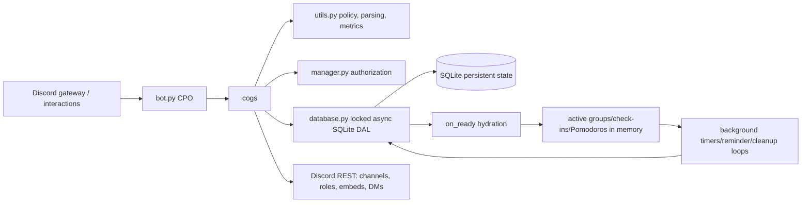

# CPO code walkthrough

This is an observed-code map of the current checkout (2026-10-05). It describes the control flow and state the files implement; repository prose is context only. Line references are file-local and should be checked against the current revision when this guide is reused. Generated caches, virtual environments, databases, `.env` files, and vendored packages are outside the scope.

## Inventory

The current checkout contains the following implementation and verification units (line counts are from this checkout; the release packaging helper is included below):

| Area | Files covered |
|---|---|
| Runtime | `bot.py` (129), `main.py` (14), `database.py` (1674), `utils.py` (545), `update_changelog.py` (32) |
| Cogs | `cogs/__init__.py` (1), `_session_controls.py` (104), `_setup_view.py` (847), `_staff_roles.py` (169), `_voice_relocation.py` (72), `checkin.py` (1617), `help.py` (77), `manager.py` (959), `pomodoro.py` (1643), `productivity_tracker.py` (46), `study_groups.py` (2710), `tasklist.py` (424), `voice_channels.py` (263) |
| Automation | `.github/scripts/extract_release_notes.py` (49), `.github/scripts/package_runtime.py` (88), `.github/workflows/ci.yml` (59), `gemini-agent.yml` (41), `prerelease.yml` (updated release packaging workflow) |
| Tests | `test_file.py` (1207); `tests/` modules: `test_bot_developer_id.py` (192), `test_cleanup_retries.py` (339), `test_database.py` (540), `test_default_vc.py` (84), `test_group_controls.py` (434), `test_manager_roles_and_perms.py` (241), `test_new_features.py` (455), `test_pomodoro_recovery.py` (562), `test_productivity_time.py` (37), `test_productivity_tracker.py` (100), `test_release_fixes.py` (780), `test_response_policy.py` (284), `test_session_controls.py` (540), `test_setup.py` (828), `test_shared_controls.py` (409), `test_staff_roles.py` (212), `test_tasklist.py` (235), `test_utils.py` (71) |

`.gitattributes`, `MANIFEST.in`, `pyproject.toml` (version `1.0.0rc5`), and the requirements files control packaging and source distribution. `docs/DATABASE_MAP.md` is the companion schema-focused map. `docs/impulse_notes.txt` is documentation text, not executable code. The deleted `cogs/study_groups.txt` backup is absent from the current checkout and has no runtime path.

## Runtime and shared services

### `bot.py`

- Lines 1–29 import Discord, configuration, logging, and the database/cog dependencies and establish extension names and environment-derived settings.
- `CPO` (30–82) owns the bot-wide `DBHandler`, developer ID, command tree, and extension lifecycle. `setup_hook` initializes the database and loads extensions; `on_ready` syncs/announces readiness and hydrates cogs; `close` closes the DAL and client.
- `on_command_error` (84–95) handles prefix-command failures. `on_app_command_error` (97–119) acknowledges or follows up privately and logs application-command failures.
- A module-level `bot = CPO()` is constructed before the `__main__` guard (around 121); the guard validates the token and runs that existing instance. `on_ready` hydrates Pomodoro/cleanup state and clears guild-specific command registrations before global sync behavior. `main.py` is a 1–14 compatibility launcher that delegates to this startup path.

### `database.py`

- Lines 1–99 define imports, row/value helpers, `DBHandler` fields, connection/open/close and the async lock/thread execution wrapper. SQLite calls are serialized and executed through the worker boundary.
- Lines 14–81 define `DBHandler`, the lock, thread executor helpers, and connection lifecycle. `create_tables` (83–415) performs schema creation and additive legacy migration; `close` is 417–422.
- Lines 424–458 provide mod-log, commands-channel, and default-VC settings. Runtime/productivity persistence is 460–556; pending Discord-cleanup records are 558–669; default durations and setup persistence are 671–746.
- `save_pomodoro_session` (749–765) and study-group persistence/update/query methods (770–1125) cover groups, rosters, ownership, active-state filtering, and channel context. Check-in persistence is 1130–1260.
- Voice/group configuration helpers (1261–1397) and manager grants/synchronization (1399–1505) precede task CRUD/scoped action methods (1507–1674). All public methods route SQLite work through the lock/thread helpers; callers rely on dict-like rows and `active` flags for restart hydration.

### `utils.py`

- Lines 1–76 centralize response visibility/acknowledgement: exact configured commands-channel or active-group context may be public; failures and unrelated contexts remain private.
- Lines 77–143 parse seconds/durations/mentions and normalize user input.
- Lines 145–277 validate command parameters, durations, memberships, and Discord objects.
- Lines 278–379 implement native Discord permission checks, manager/group decorators, and authorization predicates.
- `get_context_group` (380–390) resolves the current guild/channel to an active persisted group. `ProductivityService` (392–440) combines completed tasks with DB-measured focus seconds and calculates efficiency. `validate_bot_developer_id` (441–545) rejects missing, malformed, placeholder, or out-of-range IDs.

## Cogs and feature lifecycles

### Session/setup support

- `_session_controls.py`: `EndRequestView` (12–77) restricts an approval/decline DM to the current owner, handles timeout, and invokes the supplied end callback. `request_session_end` (79–104) sends the approval UI and reports DM failures.
- `_setup_view.py`: selectors/modals (18–156) stage category, default voice, and lifetime choices. `SetupView` (157–328) stores a draft, enforces the initiating staff authority, renders status, and invalidates controls. `save`/`_save_locked` (329–576) re-check settings and permissions, create/reuse category and channels, sync role/category overwrites, save atomically, and retain handles on failure. Recovery/cancel/timeout (577–628) and `recover_retained_resources`/`_recover_retained_resources_locked` (629–773) delete only session-owned uncommitted resources or restore moved channels after ownership, active-setting, emptiness, and authority checks. Formatting/error hooks (774–847) expose results.
- `_staff_roles.py`: helpers (37–66) find valid guild members, construct role overwrites, and create/reuse the CPO staff role. `sync_staff_roles` (68–169) reconciles native managers with persisted `server_sync` grants, updates category children, and reports partial Discord failures.
- `_voice_relocation.py`: `relocate_to_default_vc` (11–72) verifies destination/settings, moves a member after a video-compliance failure, and sends a DM/result without enforcing microphone state.

### `checkin.py`

- Enums and invitation UI (39–82) define Present/Absent/Break/Exited states and recipient-bound join/decline actions.
- `CheckinGuildSettings` (83–132) holds limits/permissions. Decorator factories (133–293) enforce membership, owner, roster capacity, absence/break limits, channel scope, and command permissions.
- `CheckinSession` (294–1318) is the session state machine: constructor/session ID and resource setup (399–489), reminders/status transitions (490–559, 725–839), embed/button rendering (562–724, 840–878), member actions (879–1219), owner transfer/end confirmation (1101–1296), and persistent cleanup (1297–1318).
- `CheckinCog` (1319–1617) owns active sessions, hydrates active DB rows in `cog_load`/`load_active_sessions_from_db` (1327–1421), exposes start/settings commands (1423–1614), and registers with `setup` (1615–1617).

### `manager.py`

- `PermissionLevel` (20–29) defines the five tiers. `Manager` (31–956) provides tier naming, decorators, native/stored authority evaluation (`get_permission_level`, 224–278), staff synchronization (54–77, 279–347), setup ownership/invalidating older drafts (348–430), command sync/user-level reporting (431–528), and guarded developer/manager grant/removal/list/set commands (529–956). Self-role changes are blocked and persisted grant source is respected.
- `setup` (957) registers the cog. Other cogs call its predicates and `get_permission_level` rather than duplicating the hierarchy.

### `study_groups.py`

- `GroupInvitationView` (34–114) binds accept/decline to the intended recipient. `StudyGroup` (115–1662) owns IDs, roster, role/text/voice resources, expiry, controls, and teardown locks.
- Provisioning and membership (173–468) create resources, persist the group, admit/remove members transactionally, and transfer ownership. UI/dashboard and group information/pings (589–909) publish current state.
- End/transfer/rename/lifetime and voice policy callbacks (910–1236) handle approvals, ownership changes, persisted speak/video toggles, force-video timers, and relocation. Voice-state and vote/leave/refresh callbacks are 1237–1394.
- `end_group`/`_end_group` (1395–1546) serialize teardown, persist final focus data, delete Discord resources, record uncertain cleanup for retry, retire DB state, and clear memory. `clear_group_data` (1547–1590) is the final in-memory purge. `VCFunctions` (1592–1634) is a small compatibility wrapper; invitation sending is 1634–1662.
- `StudyGroupCog` (1663–2708) hydrates groups, runs the ten-minute cleanup retry loop, configures mod-log/category settings, and implements create/list/join/leave/invite/transfer/end/purge commands. Locked creation and persisted-end fallback (1972–2165) keep Discord and DB state aligned. `setup` is 2708–2710.

### `pomodoro.py`

- Imports/constants and `calculate_pomodoro_ratio` (1–234) validate focus/break/lifetime inputs and compute the 5:1:3 schedule with minimum break rules.
- `PomodoroSession` (235–280) stores stage/deadlines, cycles, pause/dropout/attendance and focus counters. Presence, invitation, and renewal views (281–496) implement consent, join/decline, and one-day renewal interactions.
- `Pomodoro` (497–1641) persists snapshots/productivity (506–564), validates/restores snapshots and elapsed stages (565–762), serializes pause/end/removal (763–815), resolves group/session context and dashboards (816–905), and implements start/edit/end/pause/resume/invite/status commands (906–1338, 1563–1641). Gateway reconnect/ready handlers hydrate sessions; `run_timer` (1368–1489) ticks deadlines, attendance, notifications, automatic pause, and final persistence. `send_notification` (1490–1562) scopes UI/pings to the group context. `setup` is 1641–1643.

### Remaining cogs

- `help.py` (8–75): `Help.help_command` builds a private level-aware command guide within Discord embed limits; `setup` is 76–77.
- `productivity_tracker.py` (12–43): the cog calls `ProductivityService`, renders measured-focus/task metrics, acknowledges privately/publicly through shared policy, and registers at 44–46.
- `tasklist.py`: `TaskActionSelect`/views (13–134) provide owner-bound complete/delete menus and pagination. `TaskList` commands (135–423) add, complete, list, purge, and action tasks using guild/group/channel scope; `setup` is 424.
- `voice_channels.py`: `VoiceChannels` (14–255) implements `create_vc`, `delete_vc`, `delete_role`, and `delete_text_channel`, with category permission checks, DB synchronization, and rollback on failed persistence. `setup` (258–263) loads the cog then removes its public app commands, leaving these as maintenance helpers; there is no `/list_vc` command. It intentionally does not delete a study VC merely because it became empty.
- `cogs/__init__.py` is an empty package marker.

## Automation files

- `.github/scripts/extract_release_notes.py`: `extract_notes` (11–32) reads a changelog section between the requested tag and the next heading; `main` (35–45) resolves `RELEASE_TAG`/argv, writes `RELEASE_NOTES.md`, and prints a byte-count message. `.github/scripts/package_runtime.py` builds the runtime zip from the package allowlist and writes the versioned artifact under `dist`.
- `ci.yml`: on pushes to `master`, `vector-commits`, or `cpo-next`, pull requests targeting `master` or `vector-commits`, and manual dispatch, it checks out Python 3.10–3.12, installs development requirements, and runs mypy, Ruff lint, Ruff format check, and pytest with coverage. It does not contain a separate whitespace check.
- `gemini-agent.yml`: on its configured issue/dispatch events it checks out the repository, installs the agent action/runtime, and runs the Gemini automation with repository context.
- `prerelease.yml`: on prerelease tag/manual release triggers it validates with mypy/Ruff/pytest, builds wheel/sdist plus the `1.0.0rc5` runtime zip through `package_runtime.py`, derives release notes, and publishes GitHub release assets using repository secrets.
- `update_changelog.py`: `patch` (3–30) reads `CHANGELOG.md`, replaces the exact `## [1.0.0-rc.3] - 2026-09-29` heading plus blank line with a hardcoded rc.3 release block, and writes the file; the module invokes it directly at import/end of file. It accepts no CLI tag or note arguments.

## Test contracts

The suite is offline and uses `AsyncMock`/`MagicMock`, lightweight fake Discord objects, and temporary/in-memory SQLite. `test_database.py` exercises lock/thread behavior, migrations, CRUD, atomic admission, cleanup retries, runtime snapshots, scoped tasks, and focus aggregation. `test_new_features.py`, `test_group_controls.py`, `test_release_fixes.py`, and `test_response_policy.py` cover command acknowledgements, visibility, group lifecycle, voice controls, invitations, cleanup, and the 54-flow standalone matrix. `test_pomodoro_recovery.py`, `test_productivity_time.py`, and `test_session_controls.py` cover restart hydration, elapsed-stage recovery, attendance/focus accounting, pause/expiry, invitation consent, capacity races, and owner approval. `test_setup.py`, `test_default_vc.py`, and `test_cleanup_retries.py` cover staged setup, default VC/category ACLs, failed-save recovery, and durable Discord cleanup retries. `test_shared_controls.py`, `test_staff_roles.py`, `test_manager_roles_and_perms.py`, and `test_bot_developer_id.py` cover tiered authorization and staff synchronization. `test_tasklist.py`, `test_productivity_tracker.py`, and `test_utils.py` cover task scopes, metric calculation, parsers, and visibility helpers. `test_file.py` is the executable 54-flow regression harness (also imported by the release-fix pytest coverage), isolated to an in-memory DB before it runs.

## Architecture and dataflow

The main lifecycle is: startup validates configuration; `CPO.setup_hook` opens/migrates SQLite and loads extensions; Discord routes a slash command to a cog; the cog acknowledges within the interaction window, resolves guild/channel scope, asks manager/util guards for authority, mutates Discord resources and persistent rows, then updates in-memory session state. Background check-in/Pomodoro/cleanup tasks feed state changes back to SQLite and Discord. On reconnect/ready, active rows are filtered by guild/resource validity and rehydrated; teardown persists final analytics, retires rows, retries uncertain Discord deletions, and removes memory aliases.

Observed limits remain relevant: live Discord provisioning/DM/hierarchy behavior is not exercised by these tests; setup recovery provenance is in memory and is lost across restart; `study_groups.py` has large teardown/provisioning routines; and the upstream `audioop` warning remains external to repository code.

## AST boundary audit

The following exact boundary catalogue was generated from Python's `ast` `lineno`/`end_lineno` for every non-test runtime/script file in this checkout. `C` is a class, `A` an async function, and `F` a synchronous function; nested callbacks are included where the parser reports them. The preceding sections give the purpose of these blocks, while this compact index prevents prose ranges from drifting.

`bot.py`: `CPO` C30-77; `setup_hook` A39-50; `on_ready` A52-72; `close` A74-77; `on_command_error` A84-93; `on_app_command_error` A97-118.

`utils.py`: `should_use_ephemeral` A17-47; `acknowledge_interaction` A50-56; `send_response` A59-71; `parse_seconds_to_hms` F77-89; `parse_duration` F92-103; `parse_mentions` F107-141; `validate_parameters` A145-272; `has_guild_permissions` A278-318; `is_guild_manager` A321-322; `check_manager` A325-342; `is_manager` F345-349; `app_is_manager` F352-356; `is_group_creator` F359-377; `get_context_group` A380-389; `ProductivityService` C392-416; `validate_bot_developer_id` F441-545.

`database.py`: `DBHandler` C14-1674; connection/helpers F21-81; `create_tables` A83-415; `close` A417-422; settings/runtime/productivity/cleanup/setup A424-746; session/group/member queries A749-1125; check-in A1130-1260; group/voice settings A1261-1397; manager grants A1399-1505; task operations A1507-1674. This grouping is intentionally aligned to the exact DB map in `docs/DATABASE_MAP.md`; the nested `_sync` functions are transaction bodies inside the cited methods.

Cog boundaries: `_session_controls.py` `EndRequestView` C12-76, `request_session_end` A79-104; `_setup_view.py` selectors/modals C18-154 and `SetupView` C157-847; `_staff_roles.py` helpers F37-65 and `sync_staff_roles` A68-169; `_voice_relocation.py` `relocate_to_default_vc` A11-72; `checkin.py` `CheckinSession` C294-1316 and `CheckinCog` C1319-1609; `help.py` `Help` C8-73; `manager.py` `Manager` C31-954; `pomodoro.py` ratio F179-232, views C281-494, `Pomodoro` C497-1638; `productivity_tracker.py` `ProductivityTracker` C12-41; `study_groups.py` `StudyGroup` C115-1660 and `StudyGroupCog` C1663-2705; `tasklist.py` views C13-132 and `TaskList` C135-419; `voice_channels.py` `VoiceChannels` C14-255. Each class's methods are the exact AST blocks described in its file subsection above.

Script boundaries: `extract_release_notes.py` `extract_notes` F11-32 and `main` F35-45; `package_runtime.py` `require_members` F15-18 and `package_runtime` F21-81; `update_changelog.py` `patch` F3-30. `main.py` and `cogs/__init__.py` contain no function/class definitions.

## Complete definition index

Generated from the current source AST. Every class, function, method and nested callback is indexed below; the preceding walkthrough explains their surrounding flow. Line spans refer to definition bodies, excluding decorators.

Total definitions indexed: **428**.

**bot.py**: `CPO` 30-77; `CPO.__init__` 31-37; `CPO.setup_hook` 39-50; `CPO.on_ready` 52-72; `CPO.close` 74-77; `on_command_error` 84-93; `on_app_command_error` 97-118

**main.py**: No definitions.

**database.py**: `DBHandler` 14-1674; `DBHandler.__init__` 15-19; `DBHandler._run_in_thread` 21-44; `DBHandler._fetchone_sync` 46-49; `DBHandler._fetchall_sync` 51-54; `DBHandler._execute_commit_sync` 56-60; `DBHandler._executemany_commit_sync` 62-66; `DBHandler.connect` 68-81; `DBHandler.connect._open` 69-72; `DBHandler.connect._connect` 76-77; `DBHandler.create_tables` 83-415; `DBHandler.create_tables._sync` 84-411; `DBHandler.close` 417-422; `DBHandler.set_mod_log_channel` 424-431; `DBHandler.get_mod_log_channel` 433-440; `DBHandler.get_commands_channel` 442-449; `DBHandler.get_default_vc` 451-458; `DBHandler.save_pomodoro_runtime` 460-479; `DBHandler.save_pomodoro_runtime._sync` 463-476; `DBHandler.get_active_pomodoro_runtime` 481-500; `DBHandler.retire_pomodoro_runtime` 502-508; `DBHandler.retire_group_pomodoro_runtime` 510-516; `DBHandler.save_productivity_focus_time` 518-538; `DBHandler.get_session_productivity_focus_seconds` 540-547; `DBHandler.get_productivity_focus_seconds` 549-556; `DBHandler.record_pending_cleanup` 558-609; `DBHandler.record_pending_cleanup._sync` 571-597; `DBHandler.get_pending_cleanups` 611-624; `DBHandler.update_cleanup_retry` 626-647; `DBHandler.delete_pending_cleanup` 649-657; `DBHandler.get_pending_cleanup_count` 659-669; `DBHandler.get_default_group_duration` 671-678; `DBHandler.get_default_pomodoro_duration` 680-687; `DBHandler.save_setup` 689-746; `DBHandler.save_setup._sync` 714-743; `DBHandler.save_pomodoro_session` 749-765; `DBHandler.save_study_group` 770-843; `DBHandler.save_study_group._sync` 773-839; `DBHandler.update_study_group_by_id` 846-920; `DBHandler.get_user_created_group_count` 922-930; `DBHandler.get_user_created_group_count._sync` 923-927; `DBHandler.get_user_joined_group_count` 932-948; `DBHandler.get_user_joined_group_count._sync` 933-945; `DBHandler.get_user_group` 950-984; `DBHandler.get_user_group._sync` 951-979; `DBHandler.get_study_group_by_channel` 986-997; `DBHandler.fetch_study_group_by_name` 1000-1010; `DBHandler.fetch_study_group_by_id` 1013-1026; `DBHandler.add_member_to_study_group_db` 1029-1040; `DBHandler.remove_member_from_study_group_db` 1043-1047; `DBHandler.transfer_ownership_study_group_db` 1050-1054; `DBHandler.fetch_members_of_group` 1057-1063; `DBHandler.fetch_owner_of_group` 1066-1071; `DBHandler.delete_study_group` 1074-1093; `DBHandler.delete_study_group._sync` 1075-1089; `DBHandler.get_study_groups_of_user` 1096-1106; `DBHandler.get_all_study_groups_of_guild` 1109-1114; `DBHandler.get_guild_group_names` 1116-1121; `DBHandler.get_all_study_groups` 1123-1125; `DBHandler.save_checkin_session` 1130-1156; `DBHandler.update_checkin_session` 1159-1194; `DBHandler.fetch_checkin_session` 1197-1203; `DBHandler.add_or_update_checkin_member` 1206-1222; `DBHandler.fetch_checkin_members` 1225-1231; `DBHandler.fetch_active_checkin_sessions` 1234-1243; `DBHandler.delete_checkin_session` 1246-1256; `DBHandler.delete_checkin_session._sync` 1249-1252; `DBHandler.get_study_group` 1258-1269; `DBHandler.update_group_roles` 1271-1280; `DBHandler.get_group_roles` 1282-1288; `DBHandler.update_voice_channel` 1290-1302; `DBHandler.log_vc_creation` 1304-1315; `DBHandler.get_vc_logs` 1317-1326; `DBHandler.update_vc_cleanup_time` 1328-1336; `DBHandler.get_vc_cleanup_time` 1338-1344; `DBHandler.update_vc_category` 1346-1354; `DBHandler.get_vc_category` 1356-1362; `DBHandler.update_group_category` 1364-1372; `DBHandler.get_group_category` 1374-1380; `DBHandler.update_default_max_members` 1382-1390; `DBHandler.get_default_max_members` 1392-1397; `DBHandler.add_manager` 1399-1433; `DBHandler.add_manager._sync` 1406-1423; `DBHandler.sync_guild_manager_grants` 1435-1475; `DBHandler.sync_guild_manager_grants._sync` 1442-1471; `DBHandler.remove_manager` 1477-1482; `DBHandler.get_manager` 1484-1495; `DBHandler.get_all_managers` 1497-1505; `DBHandler.add_task` 1507-1546; `DBHandler.add_task._sync` 1511-1539; `DBHandler.complete_task` 1548-1579; `DBHandler.apply_task_action` 1581-1590; `DBHandler.get_user_tasks` 1592-1611; `DBHandler.delete_task` 1613-1644; `DBHandler.purge_group_tasks` 1646-1654; `DBHandler.purge_guild_tasks` 1656-1664; `DBHandler.purge_all_user_tasks` 1666-1674

**utils.py**: `should_use_ephemeral` 17-47; `acknowledge_interaction` 50-56; `send_response` 59-71; `parse_seconds_to_hms` 77-89; `parse_duration` 92-103; `parse_mentions` 107-141; `validate_parameters` 145-272; `has_guild_permissions` 278-318; `is_guild_manager` 321-322; `check_manager` 325-342; `is_manager` 345-349; `is_manager.predicate` 346-347; `app_is_manager` 352-356; `app_is_manager.predicate` 353-354; `is_group_creator` 359-377; `is_group_creator.predicate` 360-375; `get_context_group` 380-389; `ProductivityService` 392-416; `ProductivityService.__init__` 393-394; `ProductivityService.get_productivity_metrics` 396-406; `ProductivityService.get_tasks_completed` 408-411; `ProductivityService.calculate_efficiency` 413-416; `validate_bot_developer_id` 441-545

**update_changelog.py**: `patch` 3-30

**cogs/__init__.py**: No definitions.

**cogs/_session_controls.py**: `EndRequestView` 12-76; `EndRequestView.__init__` 13-27; `EndRequestView.interaction_check` 29-33; `EndRequestView.close` 35-45; `EndRequestView.approve` 48-58; `EndRequestView.decline` 61-71; `EndRequestView.on_timeout` 73-76; `request_session_end` 79-104

**cogs/_setup_view.py**: `CategorySelect` 18-48; `CategorySelect.__init__` 19-29; `CategorySelect.callback` 31-48; `VoiceSelect` 51-80; `VoiceSelect.__init__` 52-62; `VoiceSelect.callback` 64-80; `NewCategoryModal` 83-113; `NewCategoryModal.__init__` 84-90; `NewCategoryModal.on_submit` 92-113; `DurationModal` 116-154; `DurationModal.__init__` 117-127; `DurationModal.on_submit` 129-154; `SetupView` 157-847; `SetupView.__init__` 158-213; `SetupView.render` 215-281; `SetupView.disable_controls` 283-286; `SetupView.has_pending_resources` 288-300; `SetupView.allowed` 302-323; `SetupView.interaction_check` 325-326; `SetupView.create_category` 329-339; `SetupView.edit_lifetimes` 342-346; `SetupView.save` 349-357; `SetupView._save_locked` 359-574; `SetupView.recover` 577-596; `SetupView.cancel` 599-610; `SetupView.on_timeout` 612-627; `SetupView.recover_retained_resources` 629-631; `SetupView._recover_retained_resources_locked` 633-772; `SetupView.format_recovery_summary` 774-791; `SetupView.on_error` 793-809; `SetupView.retained_resources` 811-847

**cogs/_staff_roles.py**: `StaffRoleSyncError` 37-38; `_member_in_guild` 41-42; `_overwrite` 45-51; `_ensure_role` 54-65; `sync_staff_roles` 68-169

**cogs/_voice_relocation.py**: `relocate_to_default_vc` 11-72

**cogs/checkin.py**: `MemberStatus` 39-43; `MemberStatusKey` 47-49; `CheckinInvitationView` 52-79; `CheckinInvitationView.__init__` 53-56; `CheckinInvitationView.interaction_check` 58-62; `CheckinInvitationView.join` 65-71; `CheckinInvitationView.decline` 74-79; `CheckinGuildSettings` 83-291; `CheckinGuildSettings.__init__` 84-107; `CheckinGuildSettings.has_permission` 109-127; `CheckinGuildSettings.is_member` 133-146; `CheckinGuildSettings.is_member.wrapper` 137-144; `CheckinGuildSettings.check_member_limit` 150-168; `CheckinGuildSettings.check_member_limit.wrapper` 154-166; `CheckinGuildSettings.check_absence_limit` 172-184; `CheckinGuildSettings.check_absence_limit.wrapper` 176-182; `CheckinGuildSettings.check_break_limit` 188-199; `CheckinGuildSettings.check_break_limit.wrapper` 192-197; `CheckinGuildSettings.is_owner` 203-224; `CheckinGuildSettings.is_owner.wrapper` 207-222; `CheckinGuildSettings.checkin_command_permissions` 228-263; `CheckinGuildSettings.checkin_command_permissions.wrapper` 232-261; `CheckinGuildSettings.check_user_groups` 267-291; `CheckinGuildSettings.check_user_groups.wrapper` 271-289; `CheckinSession` 294-1316; `CheckinSession.__init__` 399-444; `CheckinSession.generate_session_id` 447-448; `CheckinSession.setup_checkin_resources` 451-485; `CheckinSession.increment_reminder` 490-502; `CheckinSession.update_member_statuses` 505-557; `CheckinSession.create_embed` 562-686; `CheckinSession.create_embed.get_mention` 571-574; `CheckinSession.update_embed` 689-700; `CheckinSession.disable_previous_buttons` 703-722; `CheckinSession.send_reminder_message` 725-767; `CheckinSession.run_checkin_reminders` 770-835; `CheckinSession.create_buttons` 840-875; `CheckinSession.mark_present_callback` 879-949; `CheckinSession.start_break_callback` 953-1015; `CheckinSession.join_session_callback` 1018-1049; `CheckinSession.leave_session_callback` 1053-1097; `CheckinSession.change_owner_callback` 1101-1217; `CheckinSession.change_owner_callback.new_owner_callback` 1159-1194; `CheckinSession.end_session_callback` 1220-1249; `CheckinSession._finish_end_session` 1251-1287; `CheckinSession.can_end` 1292-1294; `CheckinSession.clear_session_data` 1297-1316; `CheckinCog` 1319-1609; `CheckinCog.__init__` 1320-1325; `CheckinCog.cog_load` 1327-1329; `CheckinCog.load_active_sessions_from_db` 1332-1407; `CheckinCog.load_active_sessions_from_db.start_staggered_reminder` 1393-1396; `CheckinCog.start_checkin` 1423-1505; `CheckinCog.settings_checkin` 1518-1609; `setup` 1615-1617

**cogs/help.py**: `Help` 8-73; `Help.__init__` 9-10; `Help.help_command` 13-73; `setup` 76-77

**cogs/manager.py**: `PermissionLevel` 20-28; `Manager` 31-954; `Manager.get_tier_name` 37-46; `Manager.__init__` 48-52; `Manager._sync_staff_access` 54-72; `Manager.is_member` 78-115; `Manager.is_member.wrapper` 80-113; `Manager.is_owner` 119-156; `Manager.is_owner.wrapper` 121-154; `Manager.check_user_groups` 161-222; `Manager.check_user_groups.wrapper` 163-220; `Manager.get_permission_level` 224-277; `Manager.sync_guild_managers` 279-325; `Manager.on_ready` 328-337; `Manager.setup` 348-424; `Manager.sync_commands` 431-470; `Manager.user_level` 477-523; `Manager.sync_managers` 529-556; `Manager._handle_self_role_update_attempt` 558-622; `Manager.add_bot_developer` 626-647; `Manager.remove_bot_developer` 651-693; `Manager.add_guild_manager` 697-735; `Manager.remove_guild_manager` 739-782; `Manager.list_managers` 785-864; `Manager.set_permission_level` 874-954; `setup` 957-959

**cogs/pomodoro.py**: `calculate_pomodoro_ratio` 179-232; `PomodoroSession` 235-278; `PomodoroSession.__init__` 236-278; `PomodoroPresenceView` 281-330; `PomodoroPresenceView.__init__` 282-285; `PomodoroPresenceView.present_btn` 288-304; `PomodoroPresenceView.absent_btn` 307-330; `PomodoroInvitationView` 333-458; `PomodoroInvitationView.__init__` 334-338; `PomodoroInvitationView.interaction_check` 340-344; `PomodoroInvitationView.join` 347-437; `PomodoroInvitationView.decline` 440-458; `PomodoroRenewView` 461-494; `PomodoroRenewView.__init__` 462-466; `PomodoroRenewView.renew` 469-494; `Pomodoro` 497-1638; `Pomodoro.__init__` 498-504; `Pomodoro._runtime_key` 506-507; `Pomodoro._runtime_state` 509-532; `Pomodoro._persist_session` 534-550; `Pomodoro._persist_productivity` 552-561; `Pomodoro._snapshot_time` 564-568; `Pomodoro._snapshot_int` 571-574; `Pomodoro._advance_stages` 577-598; `Pomodoro._restore_session` 600-715; `Pomodoro.load_active_sessions_from_db` 717-761; `Pomodoro._retire_runtime` 763-770; `Pomodoro._remove_session` 772-795; `Pomodoro.set_paused` 797-808; `Pomodoro.finish_session` 810-814; `Pomodoro._resolve_group` 816-857; `Pomodoro._get_session` 859-878; `Pomodoro._update_group_gui` 880-894; `Pomodoro.start_pomodoro` 906-1088; `Pomodoro.edit_pomodoro` 1100-1194; `Pomodoro.end_pomodoro` 1197-1230; `Pomodoro._finish_pomodoro` 1232-1242; `Pomodoro.pause_pomodoro` 1245-1280; `Pomodoro.resume_pomodoro` 1283-1336; `Pomodoro.on_disconnect` 1339-1346; `Pomodoro.on_ready` 1349-1361; `Pomodoro.on_resumed` 1364-1365; `Pomodoro.run_timer` 1368-1488; `Pomodoro.send_notification` 1490-1557; `Pomodoro.pomodoro_status` 1563-1606; `Pomodoro.invite_to_pomodoro` 1613-1638; `setup` 1641-1643

**cogs/productivity_tracker.py**: `ProductivityTracker` 12-41; `ProductivityTracker.__init__` 13-16; `ProductivityTracker.productivity` 19-41; `setup` 44-46

**cogs/study_groups.py**: `GroupInvitationView` 34-112; `GroupInvitationView.__init__` 35-39; `GroupInvitationView.interaction_check` 41-45; `GroupInvitationView.join_button` 48-89; `GroupInvitationView.decline_button` 92-112; `StudyGroup` 115-1660; `StudyGroup.__init__` 116-170; `StudyGroup.generate_group_id` 173-175; `StudyGroup.setup_group_resources` 178-305; `StudyGroup.is_owner` 322-324; `StudyGroup.is_member` 327-329; `StudyGroup.add_member` 332-399; `StudyGroup.remove_member` 402-459; `StudyGroup.can_control` 462-466; `StudyGroup.transfer_ownership` 469-575; `StudyGroup.button_view` 589-649; `StudyGroup.send_welcome_message` 652-669; `StudyGroup.disable_buttons` 672-689; `StudyGroup.group_info_embed` 692-861; `StudyGroup.send_ping_message` 864-886; `StudyGroup.end_group_callback` 910-938; `StudyGroup.request_end` 940-963; `StudyGroup.request_end.confirm` 948-955; `StudyGroup.transfer_group_callback` 966-1007; `StudyGroup.transfer_group_callback.TransferUserSelect` 977-993; `StudyGroup.transfer_group_callback.TransferUserSelect.__init__` 978-983; `StudyGroup.transfer_group_callback.TransferUserSelect.callback` 985-993; `StudyGroup.rename_group_callback` 1010-1089; `StudyGroup.rename_group_callback.RenameGroupModal` 1019-1077; `StudyGroup.rename_group_callback.RenameGroupModal.__init__` 1020-1031; `StudyGroup.rename_group_callback.RenameGroupModal.on_submit` 1034-1077; `StudyGroup.extend_duration_callback` 1092-1127; `StudyGroup.speak_toggle_callback` 1129-1130; `StudyGroup.video_toggle_callback` 1132-1133; `StudyGroup._toggle_voice_permission` 1135-1146; `StudyGroup._set_voice_permission` 1148-1225; `StudyGroup._cancel_video_enforcement` 1227-1235; `StudyGroup._schedule_video_enforcement` 1237-1239; `StudyGroup.has_video` 1242-1243; `StudyGroup._enforce_video` 1245-1289; `StudyGroup.handle_voice_state_update` 1291-1297; `StudyGroup.votekick_callback` 1300-1301; `StudyGroup.leave_group_callback` 1304-1317; `StudyGroup.refresh_gui_callback` 1320-1327; `StudyGroup.check_end_condition` 1350-1392; `StudyGroup.end_group` 1395-1406; `StudyGroup._end_group` 1408-1544; `StudyGroup.clear_group_data` 1547-1590; `StudyGroup.VCFunctions` 1592-1632; `StudyGroup.VCFunctions.__init__` 1593-1597; `StudyGroup.VCFunctions.create_vc` 1599-1603; `StudyGroup.VCFunctions.delete_vc` 1605-1608; `StudyGroup.VCFunctions.update_vc_permissions` 1610-1613; `StudyGroup.VCFunctions.set_speak` 1615-1619; `StudyGroup.VCFunctions.set_video` 1621-1627; `StudyGroup.VCFunctions.force_video_timer` 1629-1632; `StudyGroup.send_invite` 1634-1660; `StudyGroupCog` 1663-2705; `StudyGroupCog.__init__` 1664-1668; `StudyGroupCog.cog_load` 1670-1672; `StudyGroupCog.cog_unload` 1674-1676; `StudyGroupCog.cleanup_retry_loop` 1679-1683; `StudyGroupCog.before_cleanup_retry_loop` 1686-1688; `StudyGroupCog.process_pending_cleanups` 1690-1694; `StudyGroupCog._process_pending_cleanups_locked` 1696-1850; `StudyGroupCog.retry_cleanups` 1856-1871; `StudyGroupCog.on_voice_state_update` 1874-1877; `StudyGroupCog.set_mod_log_channel` 1880-1896; `StudyGroupCog.log_mod_action` 1898-1918; `StudyGroupCog._send_cleanup_result` 1920-1937; `StudyGroupCog.set_group_category` 1944-1964; `StudyGroupCog.create_group` 1972-1987; `StudyGroupCog._create_group_locked` 1989-2077; `StudyGroupCog._next_group_name` 2079-2103; `StudyGroupCog._request_persisted_end` 2105-2156; `StudyGroupCog._request_persisted_end.confirm` 2113-2148; `StudyGroupCog.transfer_group` 2166-2233; `StudyGroupCog.purge_groups` 2239-2304; `StudyGroupCog.end_group` 2308-2390; `StudyGroupCog.list_groups` 2393-2414; `StudyGroupCog.join_group` 2418-2516; `StudyGroupCog.leave_group` 2520-2581; `StudyGroupCog.invite_to_group` 2588-2643; `StudyGroupCog._resolve_invite_group` 2645-2705; `setup` 2708-2710

**cogs/tasklist.py**: `TaskActionSelect` 13-61; `TaskActionSelect.__init__` 14-42; `TaskActionSelect.callback` 44-61; `TaskActionView` 64-74; `TaskActionView.__init__` 65-68; `TaskActionView.interaction_check` 70-74; `TaskPaginationView` 77-132; `TaskPaginationView.__init__` 78-86; `TaskPaginationView.update_buttons` 88-90; `TaskPaginationView.get_embed` 92-120; `TaskPaginationView.previous_button` 123-126; `TaskPaginationView.next_button` 129-132; `TaskList` 135-419; `TaskList.__init__` 136-138; `TaskList.add_task` 145-177; `TaskList.complete_task` 181-219; `TaskList._send_task_menu` 221-251; `TaskList.list_tasks` 255-295; `TaskList.delete_task` 299-336; `TaskList.purge_tasks` 343-392; `TaskList._purge_task_messages` 394-419; `TaskList._purge_task_messages.is_owned_task_message` 399-407; `setup` 422-424

**cogs/voice_channels.py**: `VoiceChannels` 14-255; `VoiceChannels.__init__` 15-17; `VoiceChannels.create_vc` 22-98; `VoiceChannels.delete_vc` 104-151; `VoiceChannels.delete_role` 157-196; `VoiceChannels.delete_text_channel` 205-255; `setup` 258-263

**.github/scripts/extract_release_notes.py**: `extract_notes` 11-32; `main` 35-45

**.github/scripts/package_runtime.py**: `require_members` 15-18; `package_runtime` 21-81
