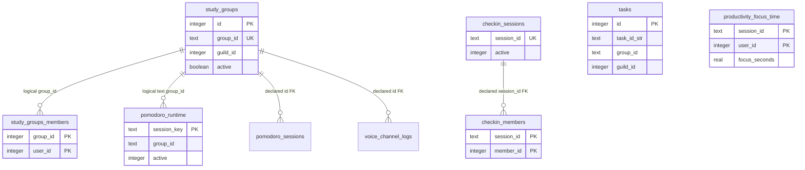
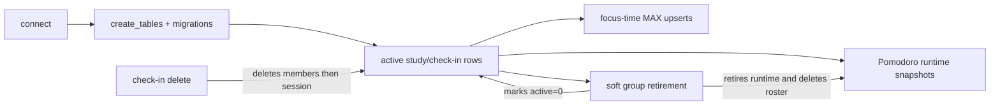

# Database map

This is a source-level map of `database.py` in the current antigravity-fix QA checkout (2026-10-05). Line references point to the implementation; SQL is summarized rather than copied. No live database or secret/config file was inspected.

## Runtime and transaction model

`DBHandler` owns one `sqlite3.Connection` opened with `check_same_thread=False` and row objects (15–19, 68–80). Every public database operation serializes access with one `asyncio.Lock`, then runs synchronous SQLite work in `asyncio.to_thread` through `_run_in_thread` (21–44). Cancellation is drained: the worker is shielded until it finishes, then `CancelledError` is re-raised. The connection helpers are `_fetchone_sync`, `_fetchall_sync`, `_execute_commit_sync`, and `_executemany_commit_sync` (46–66); write helpers use `with self.conn`, so each helper call is its own commit boundary. `connect()` creates/validates the schema after opening; `close()` closes under the same lock (68–81, 417–422).

`create_tables()` performs table discovery, legacy renames, `CREATE TABLE IF NOT EXISTS`, selected `ALTER TABLE` additions/backfills, index creation, and one final commit under the lock (83–415). SQL uses parameters for values, but `update_study_group_by_id()` and `update_checkin_session()` dynamically assemble column assignments from fixed internal allowlists (846–918, 1159–1194). No explicit `PRAGMA foreign_keys = ON` is issued; foreign-key declarations are therefore constraints in the schema but are not explicitly enabled by this layer.

## Physical schema and enforced links

### `study_groups`

Columns are `id` INTEGER primary key autoincrement, `guild_id`, `name`, unique `group_id` TEXT, `creator_id`, `owner_id`, `category_id`, `max_members`, Discord resource IDs (`group_role_id`, `vc_id`, `text_id`, `info_embed_id`), `speak_enabled`, `video_mode`, `video_timer`, `start_time`, `end_time`, `duration`, and `active` (97–117). A unique index on `group_id` is created (129–132). `group_id` is the application identifier; `id` is the legacy/numeric row identifier. Active rows use `active = 1` in most reads; `delete_study_group()` marks inactive rather than deleting the parent row (1073–1093).

### `study_groups_members`

Composite primary key `(group_id, user_id)` and a declared foreign key to `study_groups(group_id)` (164–172). The declared `group_id` type is INTEGER while the parent key is TEXT; callers consistently pass the application group ID as text. Membership is inserted during group save and admission is capped by `max_members` in the insert-select (834–839, 1029–1040). Group deletion removes membership rows but does not remove the group row (1080–1085).

### `pomodoro_sessions`

`id` primary key, nullable `group_id`, start/end timestamps, focus/short-break/long-break durations, with a declared FK to `study_groups(id)` (184–195). This is historical/session summary storage; runtime restart snapshots use a separate table.

### `pomodoro_runtime`

`session_key` TEXT primary key, text `group_id`, `guild_id`, JSON `state_json`, and integer `active` defaulting to 1 (273–280). Runtime save first requires a matching active `study_groups.group_id` and guild (460–479). Invalid JSON snapshots are retired while loading (481–500). Retirement is soft (`active = 0`) by session key or group (502–516); no FK is declared.

### `managers`

`id` primary key, `user_id`, nullable `guild_id`, `permission_level`, and `grant_source` (`explicit`/`server_sync`) (200–207). A unique expression index enforces one row per `(user_id, IFNULL(guild_id, -1))` (220–229). Startup migration converts level 2 to 3 and deduplicates rows by keeping the lowest rowid (214–228). `guild_id IS NULL` is used for global developer grants (1484–1505).

### `voice_channel_logs`

`id` primary key, nullable numeric `group_id`, `channel_id`, `creator_id`, and `create_time`, with a declared FK to `study_groups(id)` (233–243). `log_vc_creation()` records `group_id` as supplied; `get_vc_logs()` joins the numeric parent id (1304–1326).

### `guild_settings`

One row per `guild_id` primary key. Settings include VC cleanup/category, group category, commands channel, default VC, default max members, moderator log, and default group/Pomodoro durations (246–306). Setup upserts category/channel/max-members and preserves existing optional values when omitted (689–746). Missing settings return defaults in getters, notably 600 seconds for cleanup and 86,400 seconds for default durations (659–687, 1338–1362).

### `productivity_focus_time`

Composite primary key `(session_id, user_id)` with `guild_id`, text `group_id`, and non-negative `focus_seconds` check (282–290). The upsert is monotonic by `MAX(existing, incoming)`, preventing a retry from lowering measured focus (518–538). There are no foreign keys or indexes beyond the primary key.

### `pending_resource_cleanups`

Autoincrement `id`, guild/group/resource identity, retry/error timestamps, retry count, and status (308–325). An index covers `(status, guild_id)`. A pending row is reused by `resource_id`; retry updates status/error/time and optionally increments count (558–669). There is no uniqueness constraint, so deduplication is application logic.

### `tasks`

`id` primary key, `user_id`, description, completed flag, created timestamp, plus migrated nullable `group_id`, `task_id_str`, `task_number`, and `guild_id` (327–376). `task_id_str` is generated as a globally unique four-character token by a check-and-loop, but the schema has no unique index for it (1507–1546). Group/guild links are logical only; there are no FKs.

### `checkin_sessions` and `checkin_members`

Sessions have autoincrement `id`, unique `session_id`, guild/name/creator/owner/text identity, duration/timing fields, reminder counters/message ID, and `active` default 1 (377–395). Members have composite primary key `(session_id, member_id)`, status, absences, and a declared FK to `checkin_sessions(session_id)` (398–407). Session deletion explicitly deletes members then the session in one connection transaction (1245–1256).

## DAL catalogue by lifecycle

Public async operations use the database lock. The constructor and the named synchronous helpers run synchronously; callers place SQLite helper work behind the locked worker dispatcher.

**Connection/schema:** `__init__`, `_run_in_thread`, `_fetchone_sync`, `_fetchall_sync`, `_execute_commit_sync`, `_executemany_commit_sync`, `connect`, `create_tables`, `close` (14–83, 417–422).

**Guild setup/settings:** `set_mod_log_channel`, `get_mod_log_channel`, `get_commands_channel`, `get_default_vc` (424–458); `get_default_group_duration`, `get_default_pomodoro_duration`, `save_setup` (671–746); `update_vc_cleanup_time`, `get_vc_cleanup_time`, `update_vc_category`, `get_vc_category`, `update_group_category`, `get_group_category`, `update_default_max_members`, `get_default_max_members` (1328–1397).

**Pomodoro and analytics:** `save_pomodoro_session` writes a completed/configured summary (748–765); `save_pomodoro_runtime`, `get_active_pomodoro_runtime`, `retire_pomodoro_runtime`, `retire_group_pomodoro_runtime` provide restart snapshots (460–516); `save_productivity_focus_time`, `get_session_productivity_focus_seconds`, `get_productivity_focus_seconds` persist and aggregate attended focus seconds (518–556).

**Study groups/membership:** `save_study_group` upserts group fields and inserts creator plus supplied members atomically (769–844); `update_study_group_by_id` patches supported fields (845–920); `get_user_created_group_count`, `get_user_joined_group_count` count active groups (922–948); `get_user_group`, `get_study_group_by_channel`, `fetch_study_group_by_name`, `fetch_study_group_by_id` resolve active/context/name/identifier lookups (950–1026); `add_member_to_study_group_db`, `remove_member_from_study_group_db`, `transfer_ownership_study_group_db`, `fetch_members_of_group`, `fetch_owner_of_group` mutate/read roster and ownership (1028–1071); `delete_study_group` soft-deactivates and retires group runtime (1073–1093); `get_study_groups_of_user`, `get_all_study_groups_of_guild`, `get_guild_group_names`, `get_all_study_groups` enumerate groups (1095–1125); `get_study_group` returns the newest active guild group (1258–1269); `update_group_roles`, `get_group_roles`, `update_voice_channel` update/read Discord resource IDs (1271–1302).

**Check-ins:** `save_checkin_session`, `update_checkin_session`, `fetch_checkin_session`, `add_or_update_checkin_member`, `fetch_checkin_members`, `fetch_active_checkin_sessions`, and `delete_checkin_session` implement insert, partial timing/reminder/active updates, reads, member upsert, active hydration, and cascading manual deletion (1130–1256). `active = 1` is the restart selector; deletion removes the record entirely.

**Managers:** `add_manager`, `sync_guild_manager_grants`, `remove_manager`, `get_manager`, `get_all_managers` (1399–1505). Explicit grants are retained when server-synced grants are refreshed; server-synced rows absent from the new native grant set are deleted (1435–1475). Legacy rows cannot recover original provenance and are migrated as explicit by schema default (210–213).

**Tasks:** `add_task`, `complete_task`, `apply_task_action`, `get_user_tasks`, `delete_task`, `purge_group_tasks`, `purge_guild_tasks`, `purge_all_user_tasks` (1507–1674). Retrieval can be user-global, guild-scoped, group-scoped, or guild-global-only. Completion/deletion accept token, numeric `id`, or `task_number` in the older methods; `apply_task_action` accepts numeric row `id` only.

**Voice logs and cleanup retry:** `log_vc_creation`, `get_vc_logs` (1304–1326); `record_pending_cleanup`, `get_pending_cleanups`, `update_cleanup_retry`, `delete_pending_cleanup`, `get_pending_cleanup_count` (558–669).

## Compact relationship and lifecycle map

## Persistence guarantees and limitations

- Writes are serialized by one asyncio lock and committed by SQLite context managers; compound operations such as group save, group delete, check-in delete, manager sync, and cleanup deduplication execute inside one connection transaction (714–746, 773–842, 1075–1092, 1249–1255, 1442–1474).
- Reboot hydration is available for active check-in sessions and active Pomodoro runtime snapshots. Runtime JSON is validated and malformed rows are retired. Snapshots are only accepted for currently active groups; the DAL does not itself reconstruct Discord channels or in-memory objects (460–500).
- Group shutdown is represented by `study_groups.active = 0`, roster deletion, and runtime retirement. Historical Pomodoro summary rows, tasks, voice logs, focus-time rows, and pending cleanup history remain unless other code removes them (1073–1093).
- Check-in shutdown deletes all persistence, unlike group shutdown. A check-in update with no recognized mutable keys only logs and performs no write (1159–1194).
- Foreign keys are declared but not explicitly enabled; identifier types and usage are inconsistent across tables (`study_groups.group_id` text vs member/runtime text vs legacy Pomodoro/log numeric `id`). Treat these links as logical unless the hosting connection enables SQLite FK enforcement externally.
- Legacy migration is additive and narrow: it renames two old table names, adds selected columns, backfills group IDs and task guild IDs, translates selected old column names, maps manager level 2 to 3, and deduplicates managers. It does not rebuild tables, normalize all legacy identifiers, add missing indexes for task tokens, or preserve setup recovery provenance (90–183, 210–228, 339–375).
- Task guild backfill can only infer an unassigned task's guild when its group resolves, or when exactly one guild exists in groups/settings; otherwise `guild_id` remains NULL (357–375). Global task reads intentionally include NULL guild rows only under `global_only` without a guild argument (1592–1611).
- `save_productivity_focus_time` is monotonic per `(session_id,user_id)` and validates finite non-negative values, but aggregate reads sum by user alone and do not filter guild/group (518–556).

## Concrete source findings for maintainers

- `study_groups_members` declares `group_id INTEGER` while referencing the text `study_groups.group_id`; this is tolerated by current application queries but is an identifier-type mismatch (166–170).
- `save_study_group()` detects a legacy `max_size` column, writes both `max_members` and `max_size`, but the base schema/migrations do not add `max_size`; this compatibility path only applies to pre-existing legacy tables (775–831).
- `save_pomodoro_session()` still carries a TODO and writes nullable summary fields without an active/session identifier, while actual restart recovery uses `pomodoro_runtime` (748–765, 273–280).
