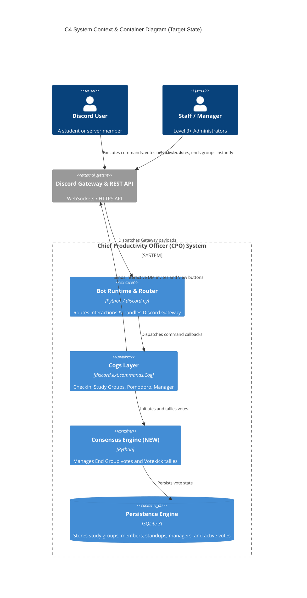
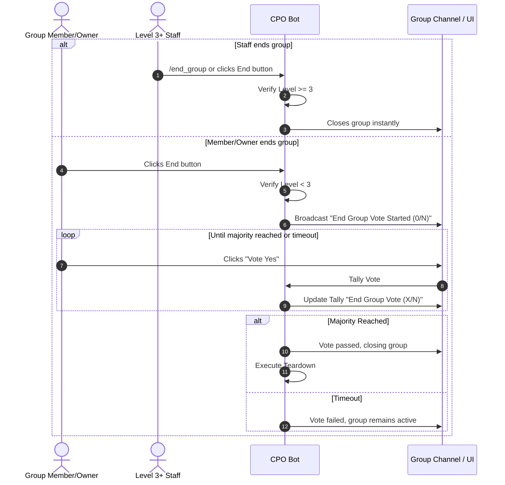
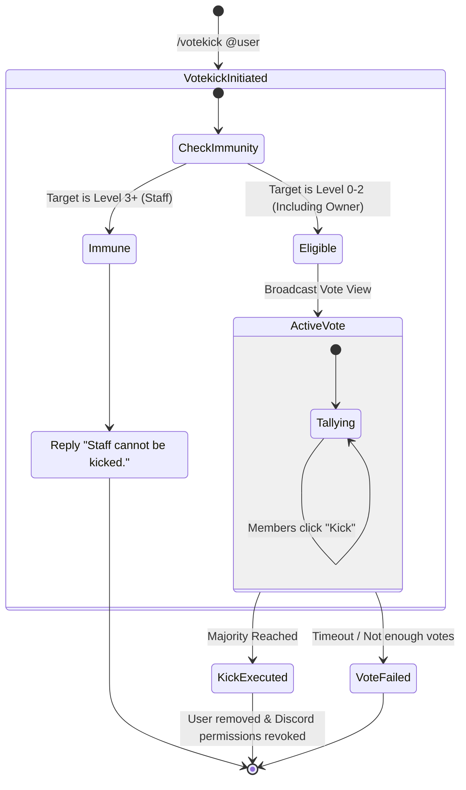
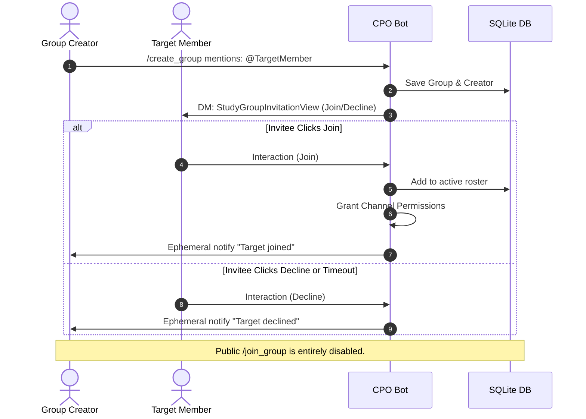
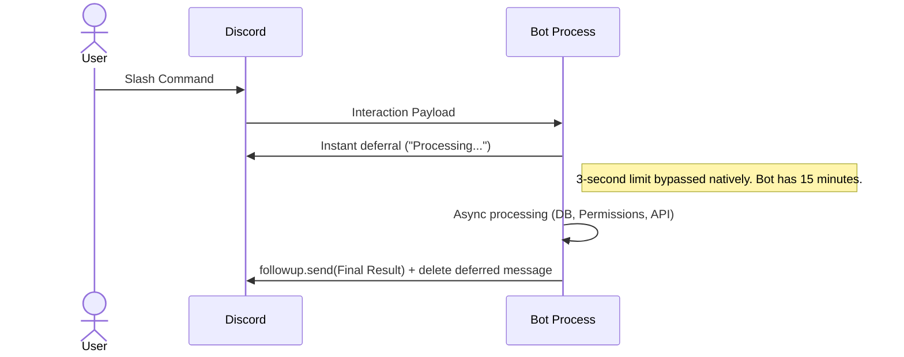

# Chief Productivity Officer (CPO) — Target Architecture (Post-Audit)

This document outlines the **target architecture** integrating the newly audited requirements: Strict Invite-Only Groups, Democratic End-Group Voting, and Votekick with Staff Immunity.

---

## 1. C4 Container Diagram

---

## 2. Target Workflows & Sequences

### 2.1 Democratic End Group Voting (Expectation #2)
Instead of owners instantly ending groups, any member or owner initiates a democratic vote. Only Level 3+ staff bypass this.

### 2.2 Votekick with Staff Immunity (Expectation #3)
Members can vote to kick any participant (including the group owner). However, Level 3+ Staff are strictly immune to votekicks.

### 2.3 Strict Invite-Only Group Admission (Expectation #4)
The current `/join_group` command is removed/disabled. Users can only join via explicit invitations (mentions during creation or `/invite` command).

---

## 3. Asynchronous Non-Blocking Processing
Commands maintain Discord API compliance (the 3-second rule) using immediate ephemeral acknowledgements (`acknowledge_interaction`), avoiding the need for heavy cross-process IPC architectures.

